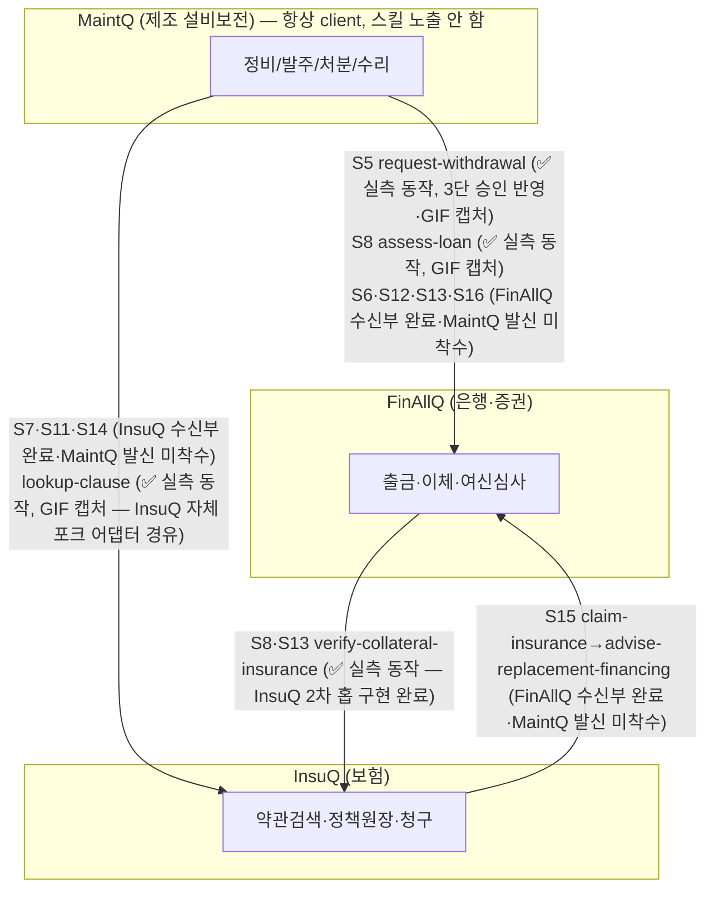
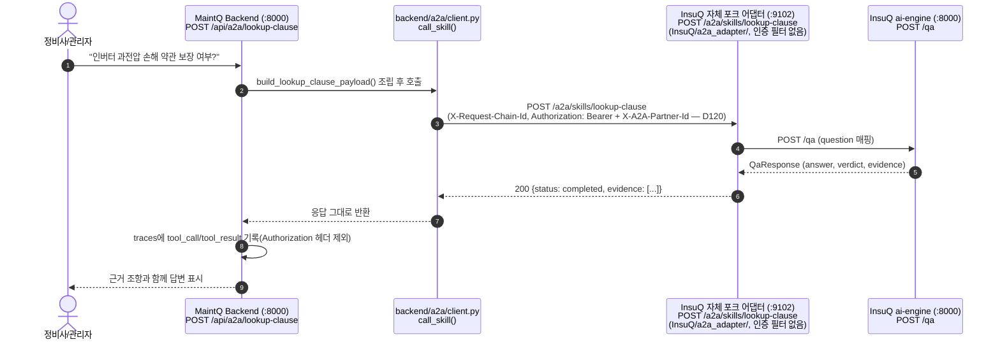
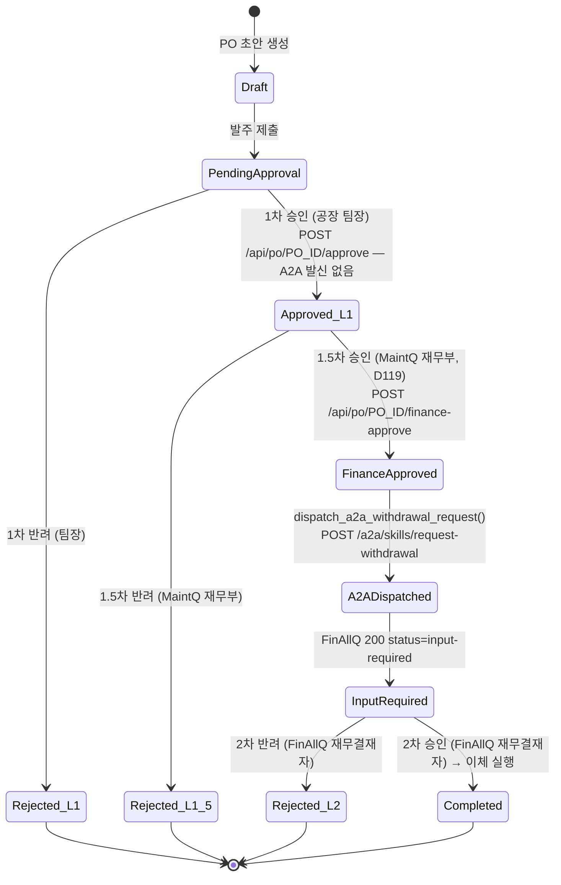
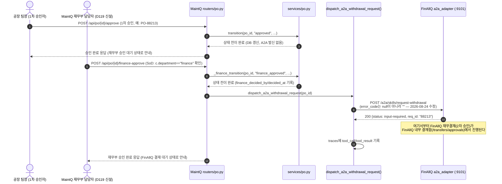
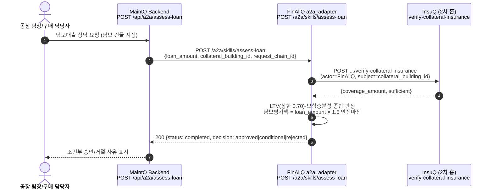
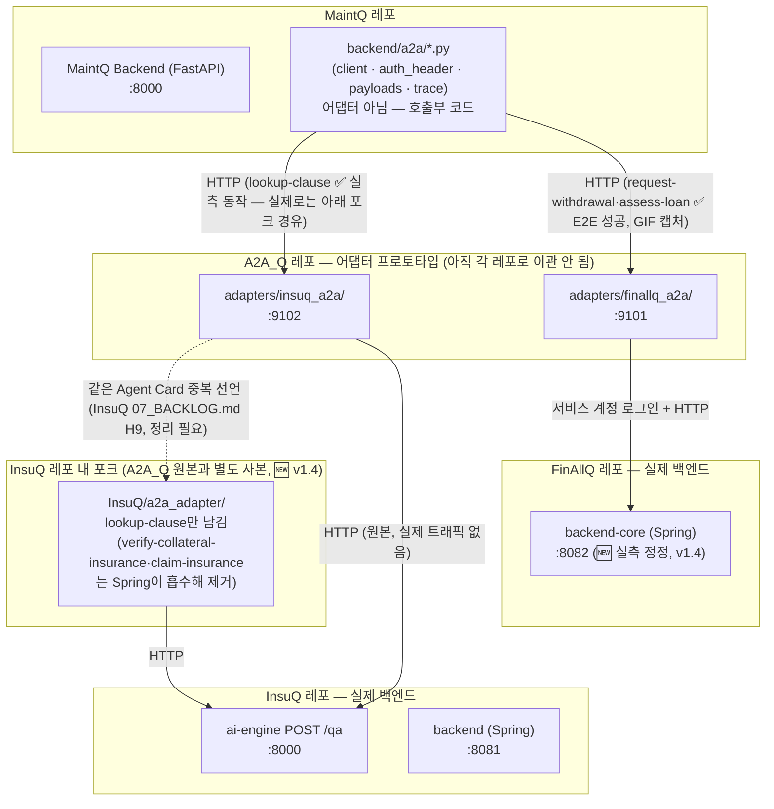
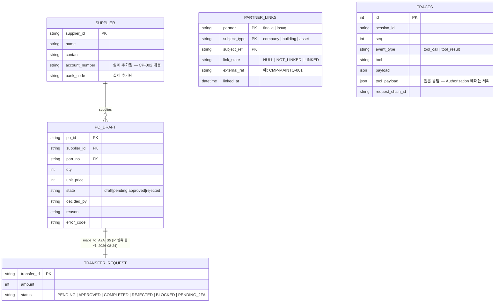
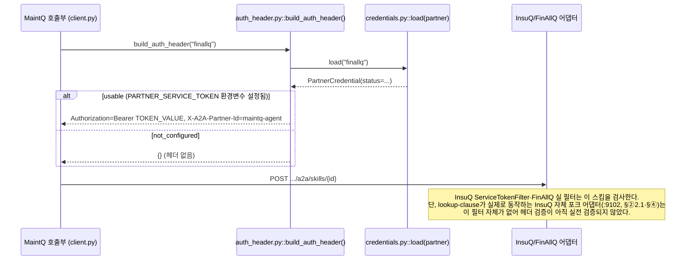

# Q 시리즈 (MaintQ · FinAllQ · InsuQ) A2A 통합 다이어그램 명세서

> **문서 버전**: v1.4 (MaintQ D119·D120 + FinAllQ Sprint 18 + 실측 GIF 캡처 반영)
> **기준 시점**: 2026-08-24

> 🆕 **v1.4 정정 (2026-08-24, MaintQ 세션 후속 반영)** — v1.3 이후 세 레포에서 동시에 진행된
> 변경을 이 문서에 소급 반영한다. 근거는 `docs/presentation/a2a-contract-and-data-flow.md`
> (MaintQ 세션이 직접 고쳐 둔 최신판)와 `FinAllQ/status.html`·`MaintQ/status.html` 실측:
>
> - **`request-withdrawal`(S5) 발신 지점이 3단 승인으로 바뀌었다(D119).** 종전엔 "팀장 승인 →
>   곧바로 A2A 발신"이었으나, MaintQ가 **자체 재무부 승인 게이트를 신설**했다 —
>   `POST /api/po/{id}/approve`(팀장, 1차)는 이제 A2A를 보내지 않고, 신규
>   `POST /api/po/{id}/finance-approve`(MaintQ 재무부, 1.5차, SoD 검사 포함)가 A2A 발신
>   지점이 됐다. 그 다음에야 FinAllQ 쪽 재무결재(2차)가 대기한다 — **MaintQ 내부 2단 + FinAllQ
>   1단, 합계 3단 승인** 구조. payload 스키마(`approved_by`)는 무변경 — 여전히 팀장 ID다.
>   아래 §② 2.2가 이 구조로 갱신됐다.
> - **인증 헤더 스킴이 원래 계획(Basic mock)과 달랐다(D120).** MaintQ가 InsuQ·FinAllQ 양쪽의
>   실제 인증 필터 코드를 직접 열어 대조한 결과, 둘 다 애초에 `Authorization: Bearer <token>` +
>   `X-A2A-Partner-Id` 자기신고 헤더만 검사하고 있었다(Basic이 아니다). 아래 §⑥이 이 실제
>   스킴으로 갱신됐다.
> - **`lookup-clause`의 "막힌 이유" 서술이 v1.0~v1.3 내내 틀려 있었다.** "MaintQ 쪽 서비스
>   자격증명 미설정으로 차단"이라고 여러 버전에 걸쳐 적었으나, 실제 원인은 **InsuQ가 스킬
>   자체를 미구현(501)**이었던 것이었다. 이제 InsuQ가 자기 레포 안에 **별도로 포크한
>   `a2a_adapter`**(`InsuQ/a2a_adapter/`, 원본은 이 레포 `adapters/insuq_a2a/`)를 통해
>   `lookup-clause`가 실제로 응답한다 — 단 이 포크엔 인증 헤더 검증 자체가 없어 D120 스킴이
>   이 경로에서는 아직 실전 검증되지 않았다. 아래 §②2.1·§④·§⑦이 이 정정을 반영한다.
> - **FinAllQ가 Sprint 18에서 `a2a_adapter` 7개 선언 스킬을 전부 실구현했다** —
>   `advise-hedge`(S6)·`advise-financing`(S16)·`advise-replacement-financing`(S15 2차 홉)·
>   `request-settlement`(S12)·`assess-used-equipment-loan`(S13) 신규 구현 + `assess-loan`(S8)을
>   임시 스키마에서 **공식 A2A_Q 계약대로 전면 재작성**(요청 `loan_amount`/`purpose`/
>   `collateral_building_id`, 응답 `status`/`decision`/`collateral_check`). MaintQ 실 백엔드와
>   재검증까지 마쳤다: `{"status":"completed","decision":"approved","collateral_check":
>   {"coverage_amount":300000000.0,"sufficient":true}}`. **단 FinAllQ 쪽 수신부가 7/7이 됐다는
>   뜻이지, MaintQ 쪽 발신 트리거는 여전히 `request-withdrawal`·`assess-loan`·`lookup-clause`
>   3종뿐이다** — 아래 §⑦ 표는 이미 이 상태를 정확히 반영하고 있었다(변경 없음).
> - **FinAllQ `backend-core`의 실제 배포 포트는 `:8080`이 아니라 `:8082`다** —
>   `a2a_adapter/main.py`의 `FINALLQ_BASE_URL` 기본값이 실제 `infra/docker-compose.yml`과
>   어긋난 상태였다. 아래 §④가 실제 포트로 정정됐다.
> - **`request-withdrawal`·`lookup-clause`·`assess-loan` 세 흐름 전부 실측 GIF 캡처가 생겼다**
>   (`docs/presentation/assets/*.gif`, 2026-08-24) — 진단→발주→3단 승인→A2A 전송까지, 채팅
>   질의→InsuQ 응답까지, 5억 대출 신청→담보 부족으로 `conditional` 판정까지 전 구간 라이브
>   캡처. 아래 §②·신설 §⑧에서 참조한다.
> - **FinAllQ·InsuQ 양쪽에 직원(심사역)용 수신 화면이 확인됐다** — FinAllQ
>   `/transfers/approvals`(MANAGER)·`/loan/review`(ADMIN 전용), InsuQ `/pro/inbox`(심사역,
>   5스킬 통합 수신함). 신설 §⑧에 정리했다.
>
> 🆕 **v1.3 정정 (2026-08-24, InsuQ 세션)**: v1.2까지 이 문서는 InsuQ 쪽 검증을 로컬
> 프로토타입 어댑터(`:9102`) 기준으로만 서술했다. **그 프레이밍이 이제 틀렸다** —
> InsuQ의 실제 A2A 수신부는 처음부터 `backend`(Spring, 로컬 `:8081` / 프로덕션
> `https://insuq-backend.onrender.com`)였고, `:9102` FastAPI 어댑터는 `lookup-clause`
> 하나만 남기고 전부 제거됐다(2026-08-23 결정, 이 레포 §④가 이미 `INSUQ_SPRING`을
> 표시해 뒀지만 시퀀스 다이어그램·서술은 갱신 안 돼 있었다). 아래는 이번 세션에서
> **InsuQ 프로덕션 배포판을 직접 재빌드·재배포하고 실측 검증한 결과**다:
>
> - **`verify-collateral-insurance`(S8/S13, FinAllQ→InsuQ) — ✅ 완전 검증.** InsuQ의
>   `effective_recovery` 필드(이전엔 항상 null)를 구현한 뒤, **FinAllQ의 실제
>   `a2a_adapter/insuq_client.py` 코드를 한 글자도 안 고치고 그대로 import해서 InsuQ
>   프로덕션 URL(`insuq-backend.onrender.com`)에 실제 HTTP 호출**을 보냈다 — 응답까지
>   FinAllQ 코드 내부 검증(`sufficient` 타입 체크)을 통과했다. `X-A2A-Partner-Id:
>   finallq-agent`, `Authorization: Bearer <서비스 토큰>` 헤더 패턴 — 로컬 어댑터가
>   아니라 **두 시스템의 실제 배포판끼리 인터넷으로 통신**한 첫 실측이다.
> - **`notify-risk-change`(S14, MaintQ→InsuQ) — InsuQ 수신부 완성, MaintQ 발신부 없음.**
>   InsuQ가 이 스킬을 구현·프로덕션 배포·curl 검증(정상 판정 3종·대역 경계·Idempotency
>   재생/충돌 6개 경로)까지 마쳤다. 그런데 **MaintQ `backend/a2a/payloads.py`에
>   `notify-risk-change`·`notify-asset-change`·`claim-insurance`를 부르는 payload
>   빌더가 하나도 없다**(직접 grep 확인, 2026-08-24) — 이 문서 §① M→I 엣지의
>   "S7·S11·S14 (미구현)"은 정확히는 "InsuQ는 구현됨, MaintQ 발신 코드가 없음"으로
>   더 정밀하게 읽어야 한다.
> - **`claim-insurance`(S15, 사고→InsuQ→승인→FinAllQ) — InsuQ 쪽 전체 생애주기 검증
>   완료.** `input-required` 발급 → 신규 심사역 계정(Flyway V8로 프로덕션에 추가)
>   로그인 → 승인 API 호출 → `completed` 전이 → 재폴링까지 실제 프로덕션 URL로
>   확인했다. 보험금 산정값(손해액×coverage/(insured×coinsurance))도 손계산과
>   전부 일치. FinAllQ 쪽 `advise-replacement-financing`(§⑦ 새 표)이 이 완료를
>   폴링해 소비하는 쪽은 InsuQ 세션에서 직접 검증하지 않았다.
> - **프로덕션 DB 준비**: `CustomerSeeder`가 `@Profile("dev")`라 배포판에는 A2A 데모
>   fixture가 자동으로 안 들어간다(의도된 설계) — Flyway `V7`(건물·정책·파트너 그랜트)·
>   `V8`(심사역 계정) 마이그레이션으로 정식으로 심었다. 이게 없었다면 위 실측 전부
>   `403 forbidden`/`policy_not_found`로 막혔을 것이다.
> **목적**: Q 시리즈 3개 시스템(제조보전 MaintQ, 은행/증권 FinAllQ, 보험 InsuQ) 간 A2A 통신과
> 각 시스템 내부 핵심 흐름을 시각화한다.
>
> ⚠️ **이 문서의 상태 표기 원칙**: 모든 다이어그램에 `✅ 실측 동작` / `🔴 설계만·미연결`
> 라벨을 명시한다. 코드가 존재한다고 곧 끝단까지 연결됐다는 뜻은 아니다 — 아래 §⑦이
> 그 구분이 가장 중요한 절이다.
>
> 🆕 **v1.2 정정 (2026-08-24)**: v1.1이 "죽은 코드"·"트리거 미연결"로 판정했던
> `request-withdrawal`(S5)과, 2차 홉 미구현으로 막혀 있던 `assess-loan`(S8) 이 **둘 다
> 실 어댑터 상대 E2E 성공(200)을 확인**했다 — 아래 §①·②·④·⑤·⑦을 그 실측으로 갱신했다.
> 또한 FinAllQ가 5개 스킬(advise-hedge·advise-financing·request-settlement·
> assess-used-equipment-loan·advise-replacement-financing)을 추가로 구현·검증했으나
> **MaintQ 발신 트리거는 아직 미착수**다(§⑦ 끝 표 참고).

---

## 📑 목차
1. [① 크로스도메인 통신 그래프 (전체 삼각형)](#-크로스도메인-통신-그래프)
2. [② A2A 시퀀스 다이어그램](#-a2a-시퀀스-다이어그램)
3. [③ 시스템별 내부 흐름 (요약)](#-시스템별-내부-흐름)
4. [④ 소유권·포트 경계 (실측)](#-소유권포트-경계-실측)
5. [⑤ 통합 엔티티 관계도 (ERD, 실측 반영)](#-통합-엔티티-관계도-erd)
6. [⑥ 인증 헤더 흐름 (실제 스킴 — Bearer + Partner-Id)](#-인증-헤더-흐름-m1-목업)
7. [⑦ MaintQ A2A 아웃바운드 — 실제 구현 상태 (가장 중요)](#-maintq-a2a-아웃바운드--실제-구현-상태)
8. [⑧ 실측 데모 캡처 & 직원용 승인 화면](#-실측-데모-캡처--직원용-승인-화면)

---

## ① 크로스도메인 통신 그래프 (전체 삼각형)

> **MaintQ는 A2A 스킬을 노출하지 않는다** — 항상 요청을 시작하는 client다
> (`docs/ref_maintq/A2A_CONTRACTS.md`). InsuQ `lookup-clause`·FinAllQ `request-withdrawal`은
> **수신자** 쪽이고, MaintQ 쪽엔 받는 어댑터가 없다 — MaintQ가 각 어댑터를 호출하는
> 클라이언트 코드만 있다(§⑦). FinAllQ `assess-loan`(S8)은 그 반대다 — MaintQ의
> 요청을 받는 수신자이면서 동시에 InsuQ `verify-collateral-insurance`를 2차 홉으로
> 부르는 **발신자**이기도 하다(위 다이어그램 F→I 엣지). 🆕 **2026-08-24**: `request-withdrawal`·
> `assess-loan`·`lookup-clause` **3종 전부** 실 어댑터 상대 E2E 성공을 확인했고 실측 GIF
> 캡처까지 확보했다(§⑧). `lookup-clause`가 막혀 있던 원인은 v1.0~v1.3이 줄곧 "MaintQ 쪽
> 서비스 자격증명 미설정"이라 서술했으나 **이건 틀린 서술이었다** — 진짜 원인은 InsuQ가
> 스킬 자체를 미구현(501)한 것이었고, InsuQ가 자기 레포에 별도 포크 어댑터를 붙이며 해소됐다
> (§②2.1·§④ 참고). FinAllQ는 Sprint 18에서 남은 5개 스킬(S6·S12·S13·S15·S16)의 수신부까지
> 전부 구현해 **7개 선언 스킬 전부 실동작**하지만, MaintQ 쪽 발신 트리거는 여전히
> `request-withdrawal`·`assess-loan`·`lookup-clause` 3종뿐이다(§⑦).

---

## ② A2A 시퀀스 다이어그램

### 2.1 lookup-clause — ✅ 실측 동작, GIF 캡처 완료 (MaintQ → InsuQ 자체 포크 어댑터)

> 🆕 **정정(2026-08-24)** — 이 절은 v1.0~v1.3 내내 "MaintQ 쪽 서비스 자격증명 미설정으로
> 차단"이라고 적었다. **그 서술은 틀렸다.** 진짜 원인은 **InsuQ가 스킬 자체를 미구현
> (501 고정)**한 것이었다. 이제 InsuQ가 이 스킬을 **자기 레포 안에 별도로 포크한 어댑터**
> (`InsuQ/a2a_adapter/`, import 경로 `a2a_adapter.*` — 이 레포 `adapters/insuq_a2a/` 원본과는
> 별개 사본)로 실제 서빙한다. Basic 인증 목업도 아니다 — 실제 필터는 D120이 밝힌 대로
> `Authorization: Bearer <token>` + `X-A2A-Partner-Id`를 검사하지만, **이 포크 어댑터엔 그
> 필터 자체가 없어** 아직 실전 검증되지 않았다. 채팅 질의부터 InsuQ 응답(근거 조항 8건,
> 판정 "판단 유보")까지 실측 9.7초, 라이브 캡처는 §⑧ 참고.

이 경로는 **끝단까지 실제로 연결돼 있고, 실측으로 200을 받았다.** 다만 InsuQ 쪽 "정식"
수신부로 설계됐던 Spring `:8081`(`A2aController`)은 이 스킬에 한해 여전히 501이고, 지금
실제로 응답하는 건 위 포크 어댑터(`:9102`)다 — 이게 임시 경로인지 최종 경로인지는 InsuQ
쪽 결정이 남아있다(`InsuQ/docs/07_BACKLOG.md` H9, §④ 참고).

### 2.2 request-withdrawal — ✅ 실측 동작, GIF 캡처 완료 (3단 승인 반영, D119)

> 🆕 **정정(2026-08-24, MaintQ D119)** — 이 절은 원래 "1차 승인(팀장)이 곧바로 A2A 요청을
> 발생시킨다"로 적혀 있었다. 2026-08-21 최초 실통신 구현 시점엔 맞는 서술이었으나, **그 뒤
> MaintQ가 자체 재무부 승인 게이트를 신설**하면서 A2A 발신 지점이 옮겨갔다. `POST
> /api/po/{id}/approve`(팀장, 1차)는 더 이상 A2A를 보내지 않는다 — 신규
> `POST /api/po/{id}/finance-approve`(MaintQ 재무부 소속 manager 전용, SoD 검사 포함,
> 1.5차)가 그 자리를 대신하고, 그 다음에야 FinAllQ 쪽 재무결재(2차)가 대기한다. **승인은
> 이제 총 3단**: 팀장(MaintQ) → 재무부(MaintQ) → 재무결재자(FinAllQ). payload 스키마의
> `approved_by`는 무변경 — 여전히 팀장(1차 승인자, `decided_by`) ID다.
>
> v1.1이 "🔴 설계·부품만 있고 트리거가 없다"로 판정했던 것도 2026-08-24에 뒤집혔다 —
> `backend/a2a/payloads.py`가 `po.get("error_code", "")`로 읽어 `NULL` 값이 그대로
> payload에 실리던 버그(`error_code`는 non-null 문자열 필수)를 `po.get("error_code") or ""`로
> 수정해 해소했다.

`dispatch_a2a_withdrawal_request()`(payload 조립·`call_skill()` 호출·trace 기록)는
**실제로 재무부 승인 라우터 경로에서 호출되고, 실 FinAllQ 어댑터가 200 `input-required`
(2단 결재 대기, 정상 비즈니스 응답)로 답하는 것까지 확인됐다.** 8개 pytest 파일
(`backend/a2a/test_*.py` 등, 86/86 통과)과 `spikes/a2a_identity_contract.py`(19/19)로
회귀도 걸려 있고, 전부 `master`에 커밋돼 있다. 2026-08-24 세션은 진단→발주 초안→팀장
승인→재무 승인→문서 3종 렌더→A2A 전송→`/manager/a2a` 이력에서 `CHAIN-PO-0122-b66672d7`
확인까지 전 구간을 라이브 캡처했다(§⑧).

### 2.3 assess-loan — ✅ 실측 동작, GIF 캡처 완료 (2차 홉 멀티홉, MaintQ → FinAllQ → InsuQ)

> 🆕 **신설(v1.4)** — v1.3까지는 이 스킬의 시퀀스가 명시적으로 없었다(§④·§⑦ 표에만
> 상태가 언급됐음). FinAllQ가 Sprint 18에서 `assess-loan`을 공식 A2A_Q 계약대로 전면
> 재작성(요청 `loan_amount`/`purpose`/`collateral_building_id`, 응답
> `status`/`decision`/`collateral_check`)한 뒤 MaintQ 실 백엔드와 재검증했으므로, 이제
> 정식 시퀀스로 등재한다.

같은 `request_chain_id`가 1차·2차 홉 전체에 전파되어 멀티홉 요청 하나를 끝까지 추적할
수 있다. 실측 캡처 2건을 확보했다 — 5천만원 소액 신청은 무조건 `approved`만 나와
판정 로직을 보여주기엔 부족했고, **5억원 대출 신청(담보 BLD-A, 담보 인정액 3억)**을
실제로 흘려 InsuQ 2차 홉 조회까지 마친 뒤 1.3초 만에 `decision: conditional`(보장 부족)이
돌아오는 것까지 확인했다(`/manager/a2a`에서 `CHAIN-LOAN-a0639920 · ok`, §⑧). 다만 이
`conditional`/`approved`는 **A2A 도메인 값일 뿐** FinAllQ backend-core의 실제
`Loan.status`는 그대로 `UNDER_REVIEW`로 남는다 — 최종 승인은 `/loan/review` 화면에서
사람(ADMIN)이 별도로 눌러야 한다(자동승인 경로 없음, §⑦·§⑧ 참고).

> ⚠️ **2026-08-29 계약 확장 — `evidence`를 "약관 인용"으로 표시하지 말 것.**
> `collateral_check`가 `coverage_amount`/`sufficient` 2필드에서
> `insured_value`·`effective_recovery`·`evidence`를 더한 **5필드**로 확장됐다
> (`docs/schemas/assess-loan.json`, FinAllQ `a2a_adapter` 반영·테스트 완료).
> 조건부 승인 판정에 "왜 부족한지"(보험가액 대비 비례보상)와 근거가 함께 실린다.
>
> 다만 `evidence`가 실어 나르는 값은 **InsuQ TASK-H08이 아직 미해결**이라
> 실제 약관 조항 인용이 아니라 **정책 레코드 요약 문자열**이다
> (`InsuQ_시나리오맵.html` 트랙4 표). 파이프라인만 열어둔 상태이므로
> 데모 슬라이드·화면이 이 값을 "약관 조항 인용 첨부"로 소개하면 안 된다.
> 2026-08-29 InsuQ 세션에 실제 인용으로의 교체를 요청해 둔 상태.
>
> **소비자 주의 — 부재는 `null`이 아니라 "키 없음"이다.** 어댑터가
> `model_dump(exclude_none=True)`로 직렬화하므로, InsuQ가 안 내려준 optional은
> JSON에서 키 자체가 사라진다. `evidence === null` 체크는 절대 걸리지 않는다 —
> `'evidence' in collateral_check`로 판별해야 하고, **"키 없음"(InsuQ 미지원)과
> "빈 배열"(InsuQ가 근거 없다고 답함)은 의미가 다르다**(빈 배열은 그대로 실린다).
>
> **필드 집합이 S13(`assess-used-equipment-loan`)과 같아졌지만 판정 규칙은 여전히
> 다르다** — S8은 `sufficient` 하나로만 `approved`/`conditional`을 가르고, S13처럼
> "비례보상 정보가 없으면 conditional"로 열화시키지 않는다. 이걸 지키는 회귀
> 테스트가 FinAllQ `tests/test_mapping.py`에 있다.

#### 홉별 요약 (시나리오 2 데모 캡처 기준)

> ⚠️ **"상태" 열 표기 주의** — `assess-loan` 응답 스키마의 `status`는 `completed` 단일값뿐이고
> (`submitted`/`working` 같은 A2A 스펙 원문의 Task 라이프사이클 상태는 이 프로젝트엔 없다),
> MaintQ→FinAllQ→InsuQ→FinAllQ→MaintQ 전체가 **동기 호출 1왕복**이라 홉 사이에 별도로
> 멈춰있는 중간 상태가 없다. `/manager/a2a` 화면이 실제로 쓰는 상태 어휘는
> `ok`/`timeout`/`unavailable`/`error`(`lib/a2a.ts::a2aStatusTone`)이다.

| 홉 | 주체 | 스킬 · 동작 | 결과 | 실제 상태 값 |
|---|---|---|---|---|
| HOP 1 | MaintQ | 상담 요청 조립 · 위임 | 요청 전송 | (호출 시작, 별도 상태 없음) |
| HOP 2 | FinAllQ | `assess-loan` | 담보=공장 건물 → 보험 확인 필요 판단 | (동일 호출 내부, 동기) |
| HOP 3 | InsuQ | `verify-collateral-insurance` | 보장 3억 · 요구 5억 → 부족 | `completed` |
| HOP 4 | FinAllQ | 결과 반영 · 판정 | 조건부 승인: 보험 증액 선행 필요 | `completed` (`decision: conditional`) |
| — | MaintQ | 회신 수신 · 표시 | "조건부 승인, 보험 3억→5억 증액 필요" | `ok` (`/manager/a2a` 표시값) |
| — | 사람 | 심사역 최종 결재 | 여신 상태는 `UNDER_REVIEW` 유지, 자동 승인 없음 | 사람 결재 ① |

---

## ③ 시스템별 내부 흐름 (요약)

세 시스템 내부 흐름(S1~S4·S9~S10·S18·S29·F5·F6, S19~S23, S24~S28)은 각 레포별
시나리오맵(`MaintQ_시나리오맵.html`·`FinAllQ_시나리오맵.html`·`InsuQ_시나리오맵.html`)이
이미 상세히 다루고 있으므로 여기서 중복하지 않는다 — 이 문서는 **A2A 경계를 넘는
흐름**에 집중한다.

---

## ④ 소유권·포트 경계 (실측)

> ⚠️ **포트 주의**: README의 "정식" 포트(FinAllQ `:9001`·InsuQ `:9002`·MaintQ `:9003`)는
> **각 레포가 나중에 자체 구현할 자리**다. 지금 실제로 도는 프로토타입 어댑터는
> 일부러 다른 포트(`:9101`·`:9102`)를 쓴다 — 헷갈리지 않게. **MaintQ는 자체 A2A
> 수신 포트가 없다**(스킬을 노출하지 않으므로). 로컬에서 InsuQ ai-engine과 MaintQ
> backend가 둘 다 기본 `:8000`을 쓰므로, 동시에 띄우려면 한쪽 포트를 바꿔야 한다.
>
> 🆕 **포트 정정(v1.4, 2026-08-24)**: `FA_CORE`는 이 문서에 줄곧 `:8080`으로 적혀
> 있었으나, FinAllQ `infra/docker-compose.yml` 실측 결과 `backend-core`는 **`:8082`**로
> 노출된다 — `a2a_adapter/main.py`의 `FINALLQ_BASE_URL` 기본값(`http://localhost:8080`)이
> 실제 배포 포트와 어긋난 상태다. 어댑터 기본값 자체를 고칠지는 FinAllQ 쪽 결정.
>
> 🆕 **InsuQ 어댑터 분기(v1.4)**: 이 문서가 그리던 "결국 각 레포로 이관"이 InsuQ 쪽은
> 스킬별로 이미 반쯤 일어났다 — InsuQ가 **자기 레포 안에 `a2a_adapter`를 별도로 포크**
> (`InsuQ/a2a_adapter/`, import 경로가 `adapters.insuq_a2a.*` → `a2a_adapter.*`로 바뀜)해서
> `lookup-clause`가 실제로 응답하는 곳은 이 포크다. `verify-collateral-insurance`·
> `claim-insurance`는 한때 이 포크에도 있었으나, Spring backend가 실제 `Policy` 테이블로
> 그 둘을 구현하면서 계약 중복을 막기 위해 포크에서는 제거되고 `lookup-clause`만 남았다.
> 이 레포(`A2A_Q`)의 `adapters/insuq_a2a/`(원본)는 여전히 존재하지만 실제 트래픽은 받지
> 않는다 — 같은 Agent Card를 두 곳이 중복 선언하는 상태라 InsuQ `docs/07_BACKLOG.md` H9에
> 정리 필요 항목으로 남아 있다.

---

## ⑤ 통합 엔티티 관계도 (ERD, 실측 반영)

---

## ⑥ 인증 헤더 흐름 (실제 스킴 — Bearer + Partner-Id, D120)

> 🆕 **정정(v1.4, 2026-08-24, MaintQ D120)** — 이 절은 원래 "M1은 목업 인증, 나중에
> Basic(client_id/secret) 실토큰 교환이 붙는다"고 적혀 있었다. **그건 계획이었을 뿐 실제와
> 달랐다.** MaintQ가 InsuQ·FinAllQ 레포의 실제 인증 필터 코드를 직접 열어 대조한 결과,
> 양쪽 다 애초에 Basic이 아니라 **`Authorization: Bearer <token>` + `X-A2A-Partner-Id`
> 자기신고 헤더만 검사**하고 있었다(FinAllQ→InsuQ 2차 홉이 이미 이 스킴으로 실 성공
> 중이었음). MaintQ는 `credentials.py`·`auth_header.py`를 이 실제 스킴에 맞춰 재작성했다.

---

## ⑦ MaintQ A2A 아웃바운드 — 실제 구현 상태 (가장 중요)

| 구성요소 | 파일 | 상태 |
|---|---|---|
| 공용 HTTP 클라이언트 | `backend/a2a/client.py` | ✅ 구현됨 · 커밋됨 |
| 인증 헤더 생성 | `backend/a2a/auth_header.py` | ✅ 구현됨 · 커밋됨 — 🆕 D120으로 실제 스킴(`Bearer` + `X-A2A-Partner-Id`)에 맞춰 재작성, 더 이상 Basic 목업 아님(§⑥) |
| payload 조립 (`request-withdrawal`·`lookup-clause`·`assess-loan`) | `backend/a2a/payloads.py` | ✅ 구현됨 · 커밋됨 |
| trace 기록 | `backend/a2a/trace.py` | ✅ 구현됨 · 커밋됨 |
| `suppliers.account_number`·`bank_code` 컬럼 + 시드 | `data/seed.py` | ✅ 구현됨 · 커밋됨 — CP-002 갭 해소 |
| `lookup-clause` 내부 API 엔드포인트 | `backend/routers/a2a.py`, `main.py` 등록 | ✅ **끝단까지 연결됨, 실행도 됨(2026-08-24)** — 🆕 v1.0~v1.3이 "자격증명 미설정으로 차단"이라 적었던 건 **오판**이었다. 실제 원인은 InsuQ 미구현(501)이었고, InsuQ 자체 포크 어댑터로 해소돼 GIF 캡처까지 확보(§②2.1·§⑧) |
| `request-withdrawal` 트리거 배선 | `services/po.py::transition()` → `dispatch_a2a_withdrawal_request()` | ✅ **실제로 호출됨 — E2E 성공(200), GIF 캡처(2026-08-24)** — 🆕 D119로 발신 지점이 `finance-approve`(MaintQ 재무부 승인)로 이동, 총 3단 승인 구조(§②2.2) |
| `assess-loan` 트리거 + 엔드포인트 | `backend/routers/a2a.py::POST /api/a2a/assess-loan` | ✅ **끝단까지 연결됨, E2E 성공(200), GIF 캡처(2026-08-24)** — FinAllQ Sprint 18이 공식 계약대로 전면 재작성 후 InsuQ 2차 홉까지 포함해 검증(`conditional` 판정 케이스까지 실측, §②2.3) |
| 테스트 | `backend/a2a/test_*.py`(5) · `backend/routers/test_a2a.py` · `test_po_a2a_trigger.py` · `backend/services/test_po_a2a_dispatch.py` | ✅ **86/86 통과** + `spikes/a2a_identity_contract.py`(19/19) 등 회귀 |
| 커밋 | `master` 브랜치 다수 커밋(예: `dcf538b` — request-withdrawal `error_code` null 버그 수정) | ✅ **전부 커밋됨, 워킹 트리 깨끗함** |

**결론 (v1.4 갱신, 2026-08-24)**: `lookup-clause`·`request-withdrawal`·`assess-loan`
**3개 스킬 모두 코드가 끝단까지 연결돼 실제로 동작하고, 셋 다 실측 GIF 캡처까지
확보했다(§⑧).** v1.3까지 "lookup-clause만 MaintQ 쪽 자격증명 미설정으로 막혀 있다"고
적었던 건 틀린 진단이었다 — 진짜 원인은 InsuQ 미구현이었고 이제 InsuQ 자체 포크
어댑터로 해소됐다(§②2.1). `request-withdrawal`은 D119로 MaintQ 내부에 재무부 승인
단계가 하나 더 생겨 총 3단 승인 구조가 됐고(§②2.2), `assess-loan`은 FinAllQ Sprint 18의
계약 재작성 + InsuQ 2차 홉으로 조건부 승인까지 실측했다(§②2.3). **단, MaintQ 쪽
발신 트리거는 여전히 이 3종뿐이다** — FinAllQ가 나머지 5개 스킬 수신부를 전부
구현했어도(아래 표) MaintQ가 호출하지 않으면 그림의 떡이다. 자동화 테스트도 이미
충분히 갖춰져 있다(86/86 pytest + 다수 스파이크).

### 신규 — FinAllQ 추가 5스킬 (2026-08-24, MaintQ 발신 트리거 미착수)

FinAllQ가 아래 5개 스킬의 요청/응답 계약을 확정하고 자기 쪽 수신 처리(inbound)를
구현·curl 검증까지 마쳐 MaintQ 쪽에 공유했다(Sprint 18, §① 참고). **MaintQ 쪽 발신
트리거(payload 빌더 + 라우터)는 아직 하나도 없다** — 이번 시연 범위가
`request-withdrawal`·`assess-loan`·`lookup-clause` 세 개로 확정돼 있어(🆕 v1.4:
`lookup-clause`가 InsuQ 측 해소로 시연 범위에 합류, §②2.1) 나머지는 시연 이후로
미뤄 둔 상태다(MaintQ `docs/07_BACKLOG.md` P34).

| 스킬 | 시나리오(A2A_Q 번호) | FinAllQ 쪽 상태 | MaintQ 쪽 상태 |
|---|---|---|---|
| `advise-hedge` | S6 | ✅ 구현·curl 검증 완료 | 🔴 발신 트리거 미착수(시연 이후 예정) |
| `advise-financing` | S16 | ✅ 구현·curl 검증 완료 | 🔴 발신 트리거 미착수(시연 이후 예정) |
| `request-settlement` | S12 | ✅ 구현·curl 검증 완료 | 🔴 발신 트리거 미착수(시연 이후 예정) |
| `assess-used-equipment-loan` | S13 | ✅ 구현·curl 검증 완료 | 🔴 발신 트리거 미착수(시연 이후 예정) |
| `advise-replacement-financing` | S15(2차 홉 전용 — InsuQ `claim-insurance` 이후에만 호출) | ✅ 구현·curl 검증 완료 | 🔴 발신 트리거 미착수(시연 이후 예정) — MaintQ에 `claim-insurance` 호출 흐름 자체가 있는지도 확인 필요 |

---

## ⑧ 실측 데모 캡처 & 직원용 승인 화면

> 🆕 **신설(v1.4, 2026-08-24)**. §②의 각 시퀀스가 실제로 브라우저에서 라이브로 확인됐다는
> 근거와, 발표 데모에서 "MaintQ뿐 아니라 상대방 화면에도 요청이 뜬다"를 보여줄 때 쓸 실제
> 화면 경로를 정리한다.

### 실측 GIF 캡처 (`docs/presentation/assets/`)

| 파일 | 시나리오 | 내용 |
|---|---|---|
| `maintq-finallq-withdrawal-success.gif` | S5 request-withdrawal | 진단→발주 초안→팀장 승인→재무 승인→문서 3종 렌더→A2A 전송→`/manager/a2a`에서 `CHAIN-PO-0122-b66672d7 · ok` 확인까지 전 구간 |
| `maintq-insuq-lookup-clause-success.gif` | lookup-clause | 채팅 질의부터 InsuQ 실 응답(근거 조항 8건, 판정 "판단 유보") 도착까지, 실측 9.7초 |
| `maintq-finallq-insuq-loan-success.gif` | S8 assess-loan (2차 홉) | 5억원 대출 신청(담보 BLD-A, 담보 인정액 3억)→InsuQ 2차 홉 조회→1.3초 만에 `decision: conditional`(보장 부족)→`/manager/a2a`에서 `CHAIN-LOAN-a0639920 · ok` 확인 |

### 직원(심사역)용 승인 화면 — 상대방 시스템에서 요청이 뜨는 곳

**FinAllQ (시나리오별로 화면이 다르다):**

| 화면 | 라우트 | 역할 | 데모 계정 |
|---|---|---|---|
| 출금요청 결재함 | `/transfers/approvals` (`ApprovalInboxPage`) | MANAGER | `demo-manager@finallq.example` / `Test1234!` — ⚠️ 2026-08-23 세션 로그에 비밀번호 해시 불일치로 401 나던 버그 기록 있음, 데모 전 재확인 권장 |
| 여신 심사 화면 | `/loan/review` (`LoanReviewPage`) | **ADMIN 전용** | `test01@test.com` — assess-loan 응답이 "여신 심사 카드"에 5섹션 회신서 양식으로 표시되지만, **A2A의 `approved`/`conditional`이 자동 반영되지 않는다** — backend `Loan.status`는 그대로 `UNDER_REVIEW`로 남고 최종 승인은 이 화면에서 사람이 별도로 눌러야 한다(§②2.3 참고) |

**InsuQ:**

| 화면 | 라우트 | 역할 | 데모 계정 |
|---|---|---|---|
| A2A 요청 수신함 | `/pro/inbox` (TASK-H04, 2026-08-24 완료) | 심사역 | `staff-reviewer.demo@insuq.dev` / `InsuqDemo!2026` — 5개 A2A 스킬 전체 수신 로그를 이메일함처럼 보여줌. 조회성 스킬(`verify-collateral-insurance` 등)은 "자동완료"로만 기록(액션 없음), `claim-insurance`만 "승인대기"로 떠서 개별 승인/반려(전자서명 코멘트 필수) |
| 보험금 지급 결재함 | `/pro/payout-requests` | 심사역→부서장→재무 다단계 | 위 수신함과 별개 데모(보험금 지급 다단계 결재) — S1/S4 크로스팀 데모 목적엔 `/pro/inbox` 쪽이 더 정확히 대응한다 |

---

> **문서 맺음말**: 이 버전은 A2A_Q·InsuQ·FinAllQ·MaintQ 네 레포의 실제 소스코드를
> 직접 읽고 검증해 작성했다(각 파일의 git diff·실제 함수 정의 확인). 이전 버전(v1.0)이
> 주장했던 "구현 확정", 존재하지 않는 스킬(`loan-underwrite`), MaintQ의 A2A 수신
> 어댑터, 실제와 다른 포트 번호는 v1.1에서 제거·정정했다. **v1.2(2026-08-24)**는
> 반대 방향의 오류를 고쳤다 — v1.1이 "죽은 코드"·"미구현"으로 과소평가했던
> `request-withdrawal`·`assess-loan`이 실은 실 어댑터 상대 E2E 성공까지 확인된
> 상태였다(§②·§⑦). 실측 문서도 한쪽으로만 틀리지 않는다 — 과소평가도 과대평가만큼
> 정정 대상이다. **v1.4(2026-08-24)**는 그 이후 세 레포에서 동시에 진행된 변경
> (MaintQ D119 재무부 승인 게이트·D120 인증 스킴 정정, FinAllQ Sprint 18의 7/7 스킬
> 완성, InsuQ의 lookup-clause 자체 포크 어댑터)을 소급 반영하고, `lookup-clause`가
> v1.0~v1.3 내내 잘못 진단돼 있던 것을 바로잡았다 — 세 시나리오(`request-withdrawal`·
> `lookup-clause`·`assess-loan`) 전부 실측 GIF 캡처와 직원용 승인 화면 경로까지
> 확보된 상태다(§⑧).
