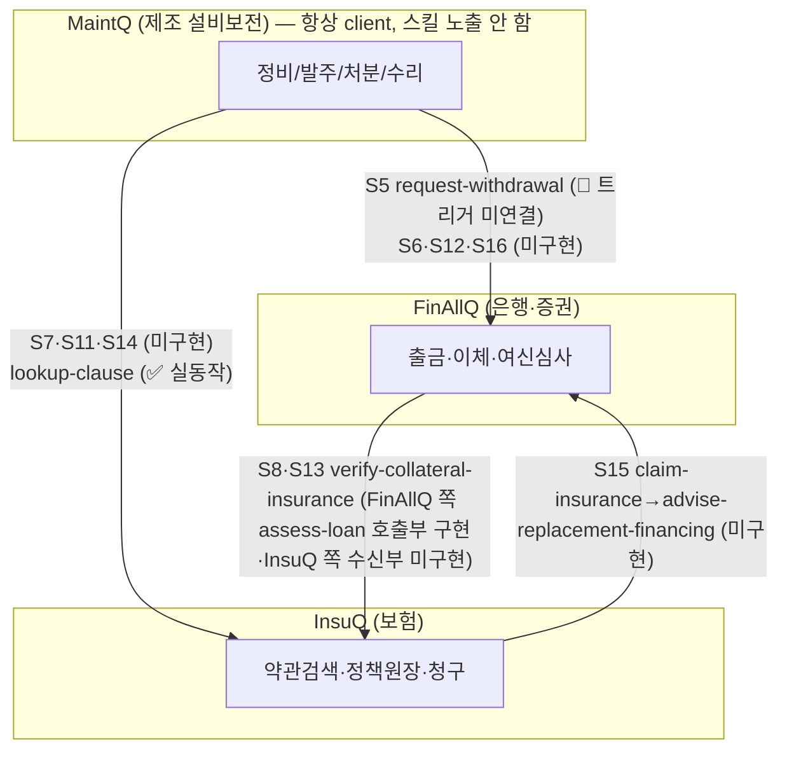
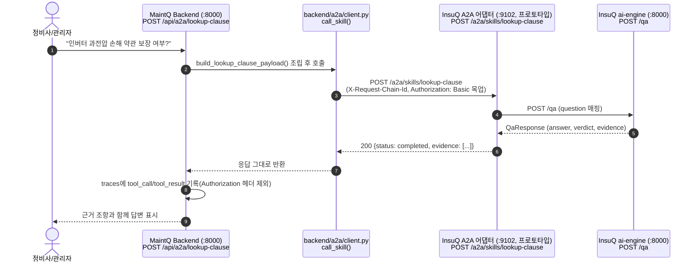
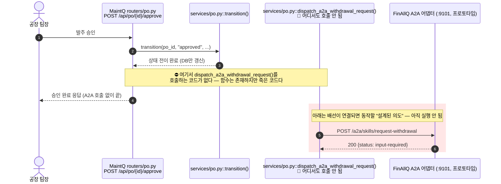
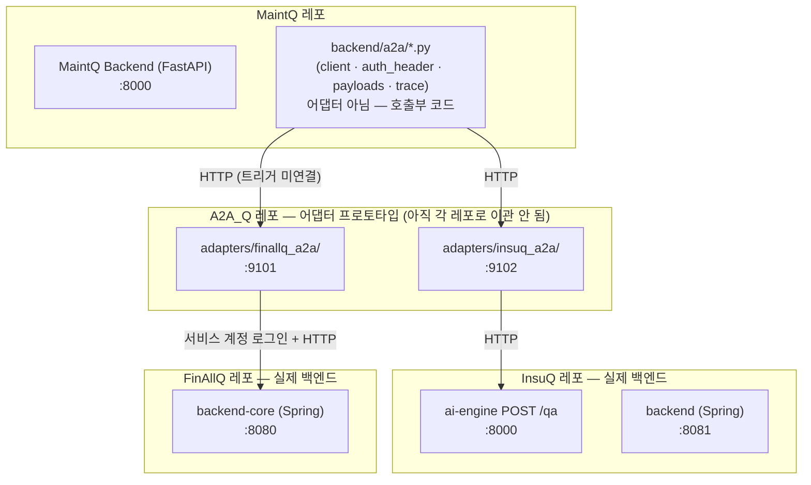
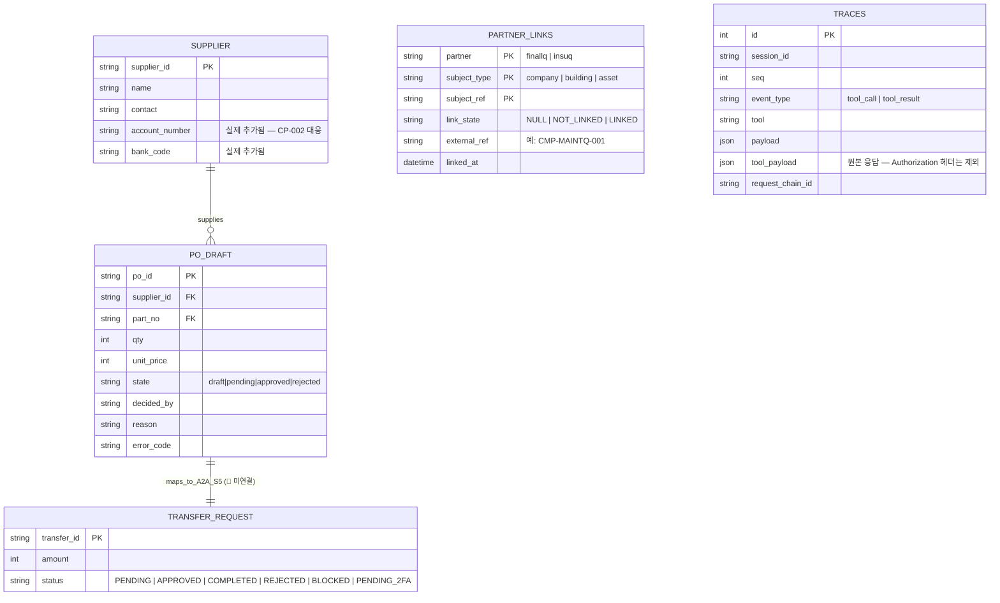
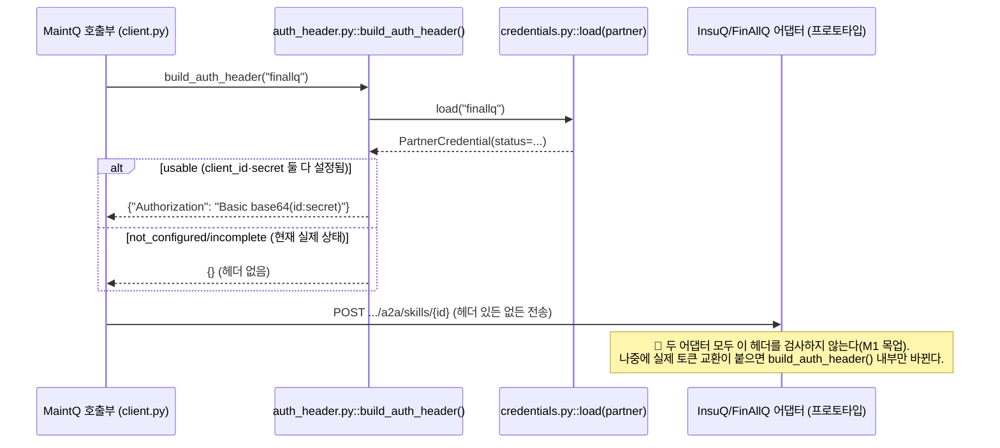

# Q 시리즈 (MaintQ · FinAllQ · InsuQ) A2A 통합 다이어그램 명세서

> **문서 버전**: v1.1 (실측 기준 정정)
> **기준 시점**: 2026-08-21
> **목적**: Q 시리즈 3개 시스템(제조보전 MaintQ, 은행/증권 FinAllQ, 보험 InsuQ) 간 A2A 통신과
> 각 시스템 내부 핵심 흐름을 시각화한다.
>
> ⚠️ **이 문서의 상태 표기 원칙**: 모든 다이어그램에 `✅ 실측 동작` / `🔴 설계만·미연결`
> 라벨을 명시한다. 코드가 존재한다고 곧 끝단까지 연결됐다는 뜻은 아니다 — 아래 §⑦이
> 그 구분이 가장 중요한 절이다.

---

## 📑 목차
1. [① 크로스도메인 통신 그래프 (전체 삼각형)](#-크로스도메인-통신-그래프)
2. [② A2A 시퀀스 다이어그램](#-a2a-시퀀스-다이어그램)
3. [③ 시스템별 내부 흐름 (요약)](#-시스템별-내부-흐름)
4. [④ 소유권·포트 경계 (실측)](#-소유권포트-경계-실측)
5. [⑤ 통합 엔티티 관계도 (ERD, 실측 반영)](#-통합-엔티티-관계도-erd)
6. [⑥ 인증 헤더 흐름 (M1 목업)](#-인증-헤더-흐름-m1-목업)
7. [⑦ MaintQ A2A 아웃바운드 — 실제 구현 상태 (가장 중요)](#-maintq-a2a-아웃바운드--실제-구현-상태)

---

## ① 크로스도메인 통신 그래프 (전체 삼각형)

> **MaintQ는 A2A 스킬을 노출하지 않는다** — 항상 요청을 시작하는 client다
> (`docs/ref_maintq/A2A_CONTRACTS.md`). InsuQ `lookup-clause`·FinAllQ `request-withdrawal`은
> **수신자** 쪽이고, MaintQ 쪽엔 받는 어댑터가 없다 — MaintQ가 각 어댑터를 호출하는
> 클라이언트 코드만 있다(§⑦). 🆕 FinAllQ `assess-loan`(S8)은 그 반대다 — MaintQ의
> 요청을 받는 수신자이면서 동시에 InsuQ `verify-collateral-insurance`를 2차 홉으로
> 부르는 **발신자**이기도 하다(위 다이어그램 F→I 엣지).

---

## ② A2A 시퀀스 다이어그램

### 2.1 lookup-clause — ✅ 실측 동작 (MaintQ → InsuQ 어댑터)

이 경로는 **끝단까지 실제로 연결돼 있다** — `main.py`에 라우터가 등록돼 있고 기본
포트(`:9102`)도 실제 InsuQ 어댑터와 일치한다. 단, InsuQ ai-engine(실제 서비스)이 안
떠 있으면 502를 받는다 — 그건 정상 동작(설계대로).

### 2.2 request-withdrawal — 🔴 설계·부품만 있고 트리거가 없다

`dispatch_a2a_withdrawal_request()`(payload 조립·`call_skill()` 호출·trace 기록까지
전부 구현돼 있음) 자체는 잘 만들어져 있지만, **`transition()`이나 승인 라우터
어디에서도 이 함수를 부르지 않는다.** 발주를 승인해도 지금은 아무 A2A 요청도
나가지 않는다. 배선(호출 한 줄)과 테스트가 남은 작업이다.

---

## ③ 시스템별 내부 흐름 (요약)

세 시스템 내부 흐름(S1~S4·S9~S10·S18·S29·F5·F6, S19~S23, S24~S28)은 각 레포별
시나리오맵(`MaintQ_시나리오맵.html`·`FinAllQ_시나리오맵.html`·`InsuQ_시나리오맵.html`)이
이미 상세히 다루고 있으므로 여기서 중복하지 않는다 — 이 문서는 **A2A 경계를 넘는
흐름**에 집중한다.

---

## ④ 소유권·포트 경계 (실측)

> ⚠️ **포트 주의**: README의 "정식" 포트(FinAllQ `:9001`·InsuQ `:9002`·MaintQ `:9003`)는
> **각 레포가 나중에 자체 구현할 자리**다. 지금 실제로 도는 프로토타입 어댑터는
> 일부러 다른 포트(`:9101`·`:9102`)를 쓴다 — 헷갈리지 않게. **MaintQ는 자체 A2A
> 수신 포트가 없다**(스킬을 노출하지 않으므로). 로컬에서 InsuQ ai-engine과 MaintQ
> backend가 둘 다 기본 `:8000`을 쓰므로, 동시에 띄우려면 한쪽 포트를 바꿔야 한다.

---

## ⑤ 통합 엔티티 관계도 (ERD, 실측 반영)

---

## ⑥ 인증 헤더 흐름 (M1 목업)

---

## ⑦ MaintQ A2A 아웃바운드 — 실제 구현 상태 (가장 중요)

| 구성요소 | 파일 | 상태 |
|---|---|---|
| 공용 HTTP 클라이언트 | `backend/a2a/client.py` | ✅ 구현됨 (미커밋) |
| 인증 헤더 생성 | `backend/a2a/auth_header.py` | ✅ 구현됨 (미커밋) |
| payload 조립 (`request-withdrawal`·`lookup-clause`) | `backend/a2a/payloads.py` | ✅ 구현됨 (미커밋) |
| trace 기록 | `backend/a2a/trace.py` | ✅ 구현됨 (미커밋) |
| `suppliers.account_number`·`bank_code` 컬럼 + 시드 | `data/seed.py` | ✅ 구현됨 (미커밋) — CP-002 갭 해소 |
| `lookup-clause` 내부 API 엔드포인트 | `backend/routers/a2a.py`, `main.py` 등록 | ✅ **끝단까지 연결됨** (미커밋) |
| `request-withdrawal` 트리거 배선 | `services/po.py::transition()` 또는 `routers/po.py` | 🔴 **호출하는 코드 없음 — 죽은 코드** |
| 테스트 | (없음) | 🔴 **전무** |
| 커밋 | — | 🔴 **전부 워킹 트리에만 있음** |

**결론**: `lookup-clause` 경로는 실제로 동작하는 상태다(양쪽 서비스가 떠 있다면).
`request-withdrawal` 경로는 잘 설계된 부품들이 다 있는데 마지막 한 줄(호출 배선)이
빠져 있어 **아직 실행되지 않는다.** 두 경로 모두 자동화된 테스트가 없다는 점도
남은 작업이다.

---

> **문서 맺음말**: 이 버전은 A2A_Q·InsuQ·FinAllQ·MaintQ 네 레포의 실제 소스코드를
> 직접 읽고 검증해 작성했다(각 파일의 git diff·실제 함수 정의 확인). 이전 버전(v1.0)이
> 주장했던 "구현 확정", 존재하지 않는 스킬(`loan-underwrite`), MaintQ의 A2A 수신
> 어댑터, 실제와 다른 포트 번호는 이번 버전에서 제거·정정했다.
