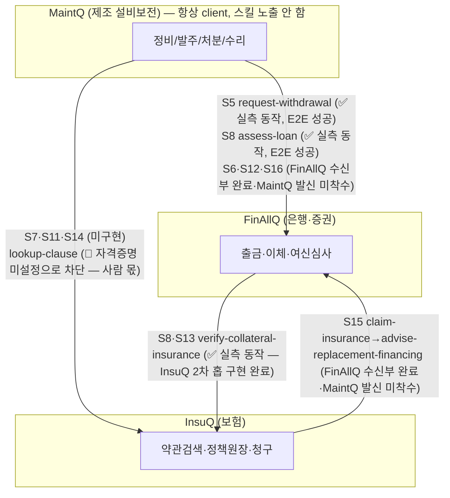
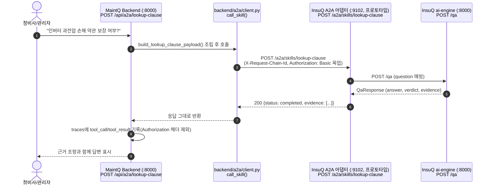
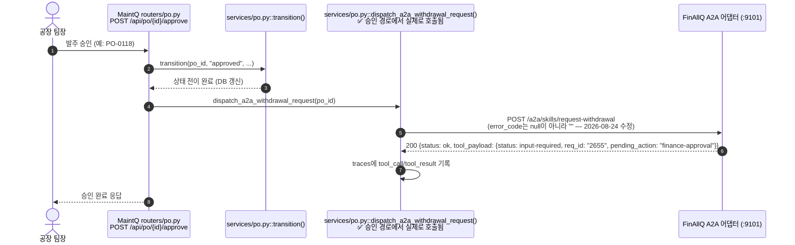
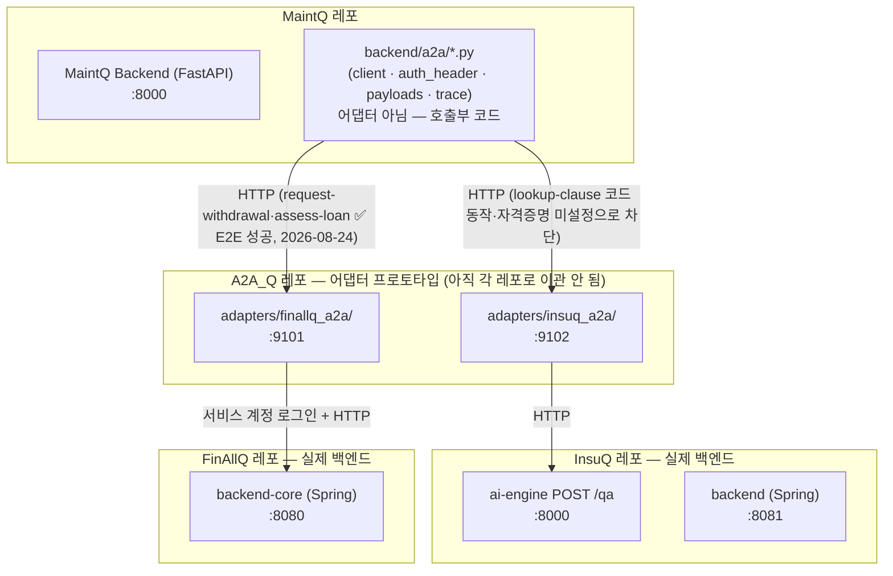
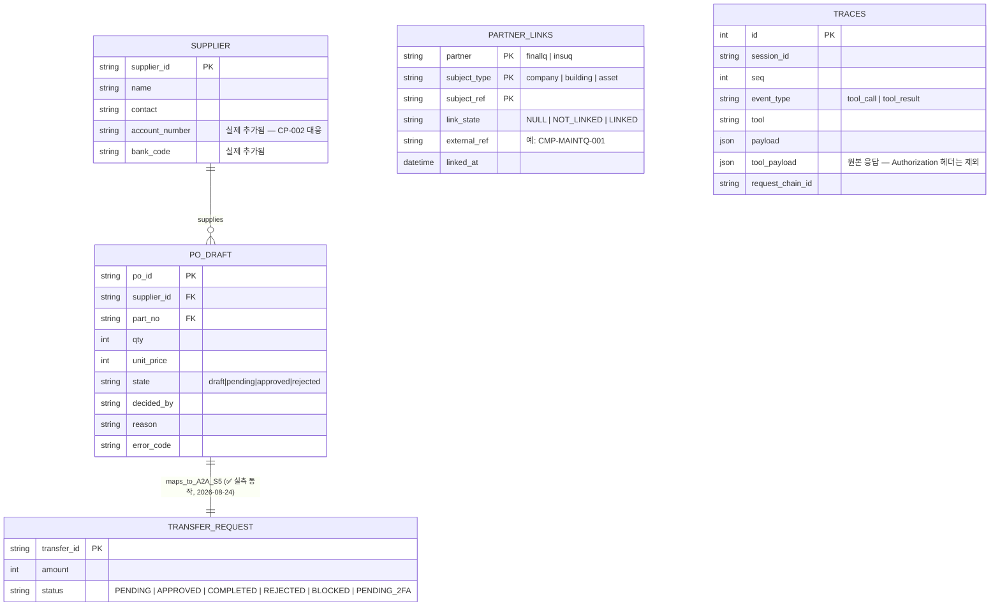
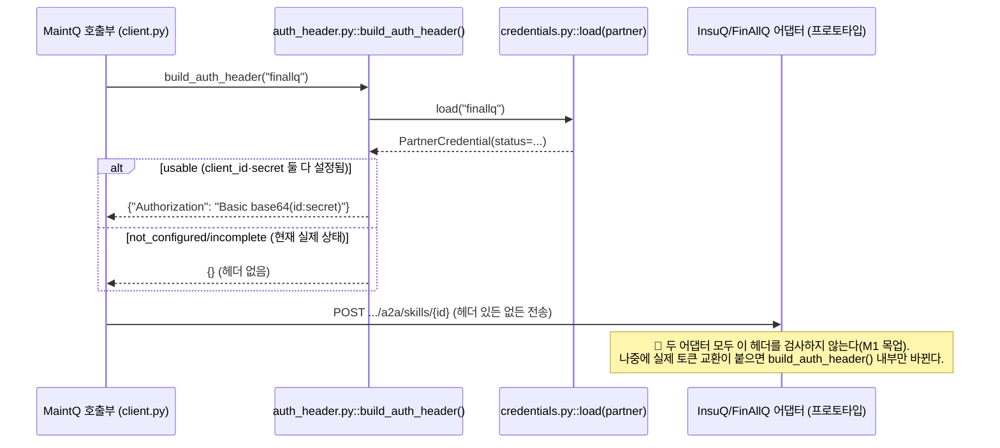

# Q 시리즈 (MaintQ · FinAllQ · InsuQ) A2A 통합 다이어그램 명세서

> **문서 버전**: v1.3 (InsuQ 프로덕션 실배포 검증 반영)
> **기준 시점**: 2026-08-24

> 🆕 **v1.3 정정 (2026-08-24, InsuQ 세션)**: v1.2까지 이 문서는 InsuQ 쪽 검증을 로컬
> 프로토타입 어댑터(`:9102`) 기준으로만 서술했다. **그 프레이밍이 이제 틀렸다** —
> InsuQ의 실제 A2A 수신부는 처음부터 `backend`(Spring, 로컬 `:8081` / 프로덕션
> `https://insuq-backend.onrender.com`)였고, `:9102` FastAPI 어댑터는 `lookup-clause`
> 하나만 남기고 전부 제거됐다(2026-08-23 결정, 이 레포 §④가 이미 `INSUQ_SPRING`을
> 표시해 뒀지만 시퀀스 다이어그램·서술은 갱신 안 돼 있었다). 아래는 이번 세션에서
> **InsuQ 프로덕션 배포판을 직접 재빌드·재배포하고 실측 검증한 결과**다:
>
> - **`verify-collateral-insurance`(S8/S13, FinAllQ→InsuQ) — ✅ 완전 검증.** InsuQ의
>   `effective_recovery` 필드(이전엔 항상 null)를 구현한 뒤, **FinAllQ의 실제
>   `a2a_adapter/insuq_client.py` 코드를 한 글자도 안 고치고 그대로 import해서 InsuQ
>   프로덕션 URL(`insuq-backend.onrender.com`)에 실제 HTTP 호출**을 보냈다 — 응답까지
>   FinAllQ 코드 내부 검증(`sufficient` 타입 체크)을 통과했다. `X-A2A-Partner-Id:
>   finallq-agent`, `Authorization: Bearer <서비스 토큰>` 헤더 패턴 — 로컬 어댑터가
>   아니라 **두 시스템의 실제 배포판끼리 인터넷으로 통신**한 첫 실측이다.
> - **`notify-risk-change`(S14, MaintQ→InsuQ) — InsuQ 수신부 완성, MaintQ 발신부 없음.**
>   InsuQ가 이 스킬을 구현·프로덕션 배포·curl 검증(정상 판정 3종·대역 경계·Idempotency
>   재생/충돌 6개 경로)까지 마쳤다. 그런데 **MaintQ `backend/a2a/payloads.py`에
>   `notify-risk-change`·`notify-asset-change`·`claim-insurance`를 부르는 payload
>   빌더가 하나도 없다**(직접 grep 확인, 2026-08-24) — 이 문서 §① M→I 엣지의
>   "S7·S11·S14 (미구현)"은 정확히는 "InsuQ는 구현됨, MaintQ 발신 코드가 없음"으로
>   더 정밀하게 읽어야 한다.
> - **`claim-insurance`(S15, 사고→InsuQ→승인→FinAllQ) — InsuQ 쪽 전체 생애주기 검증
>   완료.** `input-required` 발급 → 신규 심사역 계정(Flyway V8로 프로덕션에 추가)
>   로그인 → 승인 API 호출 → `completed` 전이 → 재폴링까지 실제 프로덕션 URL로
>   확인했다. 보험금 산정값(손해액×coverage/(insured×coinsurance))도 손계산과
>   전부 일치. FinAllQ 쪽 `advise-replacement-financing`(§⑦ 새 표)이 이 완료를
>   폴링해 소비하는 쪽은 InsuQ 세션에서 직접 검증하지 않았다.
> - **프로덕션 DB 준비**: `CustomerSeeder`가 `@Profile("dev")`라 배포판에는 A2A 데모
>   fixture가 자동으로 안 들어간다(의도된 설계) — Flyway `V7`(건물·정책·파트너 그랜트)·
>   `V8`(심사역 계정) 마이그레이션으로 정식으로 심었다. 이게 없었다면 위 실측 전부
>   `403 forbidden`/`policy_not_found`로 막혔을 것이다.
> **목적**: Q 시리즈 3개 시스템(제조보전 MaintQ, 은행/증권 FinAllQ, 보험 InsuQ) 간 A2A 통신과
> 각 시스템 내부 핵심 흐름을 시각화한다.
>
> ⚠️ **이 문서의 상태 표기 원칙**: 모든 다이어그램에 `✅ 실측 동작` / `🔴 설계만·미연결`
> 라벨을 명시한다. 코드가 존재한다고 곧 끝단까지 연결됐다는 뜻은 아니다 — 아래 §⑦이
> 그 구분이 가장 중요한 절이다.
>
> 🆕 **v1.2 정정 (2026-08-24)**: v1.1이 "죽은 코드"·"트리거 미연결"로 판정했던
> `request-withdrawal`(S5)과, 2차 홉 미구현으로 막혀 있던 `assess-loan`(S8) 이 **둘 다
> 실 어댑터 상대 E2E 성공(200)을 확인**했다 — 아래 §①·②·④·⑤·⑦을 그 실측으로 갱신했다.
> 또한 FinAllQ가 5개 스킬(advise-hedge·advise-financing·request-settlement·
> assess-used-equipment-loan·advise-replacement-financing)을 추가로 구현·검증했으나
> **MaintQ 발신 트리거는 아직 미착수**다(§⑦ 끝 표 참고).

---

## 📑 목차
1. [① 크로스도메인 통신 그래프 (전체 삼각형)](#-크로스도메인-통신-그래프)
2. [② A2A 시퀀스 다이어그램](#-a2a-시퀀스-다이어그램)
3. [③ 시스템별 내부 흐름 (요약)](#-시스템별-내부-흐름)
4. [④ 소유권·포트 경계 (실측)](#-소유권포트-경계-실측)
5. [⑤ 통합 엔티티 관계도 (ERD, 실측 반영)](#-통합-엔티티-관계도-erd)
6. [⑥ 인증 헤더 흐름 (M1 목업)](#-인증-헤더-흐름-m1-목업)
7. [⑦ MaintQ A2A 아웃바운드 — 실제 구현 상태 (가장 중요)](#-maintq-a2a-아웃바운드--실제-구현-상태)

---

## ① 크로스도메인 통신 그래프 (전체 삼각형)

> **MaintQ는 A2A 스킬을 노출하지 않는다** — 항상 요청을 시작하는 client다
> (`docs/ref_maintq/A2A_CONTRACTS.md`). InsuQ `lookup-clause`·FinAllQ `request-withdrawal`은
> **수신자** 쪽이고, MaintQ 쪽엔 받는 어댑터가 없다 — MaintQ가 각 어댑터를 호출하는
> 클라이언트 코드만 있다(§⑦). FinAllQ `assess-loan`(S8)은 그 반대다 — MaintQ의
> 요청을 받는 수신자이면서 동시에 InsuQ `verify-collateral-insurance`를 2차 홉으로
> 부르는 **발신자**이기도 하다(위 다이어그램 F→I 엣지). 🆕 **2026-08-24**: `request-withdrawal`·
> `assess-loan` 둘 다 실 어댑터 상대 E2E 성공을 확인했다 — `lookup-clause`만 여전히
> 막혀 있는데, 이번엔 코드가 아니라 **MaintQ 쪽 서비스 자격증명 미설정**(사람이 처리할 일)
> 때문이다.

---

## ② A2A 시퀀스 다이어그램

### 2.1 lookup-clause — ✅ 실측 동작 (MaintQ → InsuQ 어댑터)

이 경로는 **끝단까지 실제로 연결돼 있다** — `main.py`에 라우터가 등록돼 있고 기본
포트(`:9102`)도 실제 InsuQ 어댑터와 일치한다. 단, InsuQ ai-engine(실제 서비스)이 안
떠 있으면 502를 받는다 — 그건 정상 동작(설계대로).

> 🆕 **2026-08-24**: 코드 경로는 위 그대로 살아 있고 정상 동작하지만, 지금 실제로 호출하면
> **MaintQ 쪽 서비스 자격증명이 아직 설정되지 않아 차단된다** — 이건 코드·계약 문제가 아니라
> 사람이 자격증명을 채워야 풀리는 운영 항목이다(`TODO_직접할일.md`, MaintQ 레포).

### 2.2 request-withdrawal — ✅ 실측 동작 (2026-08-24, E2E 성공 확인)

> 🆕 v1.1은 이 절을 "🔴 설계·부품만 있고 트리거가 없다"로 판정했다 — **그 판정은
> 틀렸고, 2026-08-24에 뒤집혔다.** `dispatch_a2a_withdrawal_request()`는 실제로
> `services/po.py::transition()` → 발주 승인(`approve`) 경로에서 호출되고 있었다.
> 다만 그 실행 경로에 진짜 버그가 하나 있었다 — `backend/a2a/payloads.py`가
> `po.get("error_code", "")`로 값을 읽었는데, `po_drafts.error_code`가 `NULL`이면
> 키는 존재하고 값만 `None`이라 `.get`의 default가 적용되지 않아 `null`이 그대로
> payload에 실렸다. 이 계약(`request-withdrawal.json`)은 `error_code`를 non-null
> 문자열로 요구해서 FinAllQ가 400 `schema_validation_failed`를 냈다. `po.get(
> "error_code") or ""`로 수정해 해소했다. 아래는 수정 후 실제 왕복이다.

`dispatch_a2a_withdrawal_request()`(payload 조립·`call_skill()` 호출·trace 기록)는
**실제로 승인 라우터 경로에서 호출되고, 실 FinAllQ 어댑터가 200 `input-required`
(2단 결재 대기, 정상 비즈니스 응답)로 답하는 것까지 확인됐다.** 8개 pytest 파일
(`backend/a2a/test_*.py` 등, 86/86 통과)과 `spikes/a2a_identity_contract.py`(19/19)로
회귀도 걸려 있고, 전부 `master`에 커밋돼 있다 — v1.1이 "테스트 전무·전부 워킹
트리에만 있음"이라 적었던 §⑦ 표는 그 시점 기준으로도 부정확했다(아래 §⑦ 갱신 참고).

---

## ③ 시스템별 내부 흐름 (요약)

세 시스템 내부 흐름(S1~S4·S9~S10·S18·S29·F5·F6, S19~S23, S24~S28)은 각 레포별
시나리오맵(`MaintQ_시나리오맵.html`·`FinAllQ_시나리오맵.html`·`InsuQ_시나리오맵.html`)이
이미 상세히 다루고 있으므로 여기서 중복하지 않는다 — 이 문서는 **A2A 경계를 넘는
흐름**에 집중한다.

---

## ④ 소유권·포트 경계 (실측)

> ⚠️ **포트 주의**: README의 "정식" 포트(FinAllQ `:9001`·InsuQ `:9002`·MaintQ `:9003`)는
> **각 레포가 나중에 자체 구현할 자리**다. 지금 실제로 도는 프로토타입 어댑터는
> 일부러 다른 포트(`:9101`·`:9102`)를 쓴다 — 헷갈리지 않게. **MaintQ는 자체 A2A
> 수신 포트가 없다**(스킬을 노출하지 않으므로). 로컬에서 InsuQ ai-engine과 MaintQ
> backend가 둘 다 기본 `:8000`을 쓰므로, 동시에 띄우려면 한쪽 포트를 바꿔야 한다.

---

## ⑤ 통합 엔티티 관계도 (ERD, 실측 반영)

---

## ⑥ 인증 헤더 흐름 (M1 목업)

---

## ⑦ MaintQ A2A 아웃바운드 — 실제 구현 상태 (가장 중요)

| 구성요소 | 파일 | 상태 |
|---|---|---|
| 공용 HTTP 클라이언트 | `backend/a2a/client.py` | ✅ 구현됨 · 커밋됨 |
| 인증 헤더 생성 | `backend/a2a/auth_header.py` | ✅ 구현됨 · 커밋됨 (여전히 M1 목업 — §⑥) |
| payload 조립 (`request-withdrawal`·`lookup-clause`·`assess-loan`) | `backend/a2a/payloads.py` | ✅ 구현됨 · 커밋됨 |
| trace 기록 | `backend/a2a/trace.py` | ✅ 구현됨 · 커밋됨 |
| `suppliers.account_number`·`bank_code` 컬럼 + 시드 | `data/seed.py` | ✅ 구현됨 · 커밋됨 — CP-002 갭 해소 |
| `lookup-clause` 내부 API 엔드포인트 | `backend/routers/a2a.py`, `main.py` 등록 | ✅ **끝단까지 연결됨**(코드) · 🔴 자격증명 미설정으로 런타임 차단(사람 몫) |
| `request-withdrawal` 트리거 배선 | `services/po.py::transition()` → `dispatch_a2a_withdrawal_request()` | ✅ **실제로 호출됨 — 승인 시 자동 발신, E2E 성공(200) 확인(2026-08-24)** |
| `assess-loan` 트리거 + 엔드포인트 | `backend/routers/a2a.py::POST /api/a2a/assess-loan` | ✅ **끝단까지 연결됨, E2E 성공(200) 확인(2026-08-24)** — FinAllQ가 공식 계약대로 재구현 후 InsuQ 2차 홉까지 포함해 검증 |
| 테스트 | `backend/a2a/test_*.py`(5) · `backend/routers/test_a2a.py` · `test_po_a2a_trigger.py` · `backend/services/test_po_a2a_dispatch.py` | ✅ **86/86 통과** + `spikes/a2a_identity_contract.py`(19/19) 등 회귀 |
| 커밋 | `master` 브랜치 다수 커밋(예: `dcf538b` — request-withdrawal `error_code` null 버그 수정) | ✅ **전부 커밋됨, 워킹 트리 깨끗함** |

**결론 (2026-08-24 갱신)**: `lookup-clause`·`request-withdrawal`·`assess-loan` **3개
스킬 모두 코드가 끝단까지 연결돼 실제로 동작한다.** `lookup-clause`만 지금 실행하면
막히는데, 이유는 코드가 아니라 MaintQ 쪽 서비스 자격증명이 아직 설정 안 된 것뿐이다
(사람이 처리할 운영 항목). `request-withdrawal`은 이번에 실제 버그 하나(§②·2.2 참고)를
찾아 고쳤고, `assess-loan`은 FinAllQ 쪽 계약 재작성 + InsuQ 2차 홉 구현으로 막혀 있던
게 풀렸다 — 둘 다 실 어댑터 상대 성공 응답을 받았다. 자동화 테스트도 이미 충분히
갖춰져 있다(86/86 pytest + 다수 스파이크).

### 신규 — FinAllQ 추가 5스킬 (2026-08-24, MaintQ 발신 트리거 미착수)

FinAllQ가 아래 5개 스킬의 요청/응답 계약을 확정하고 자기 쪽 수신 처리(inbound)를
구현·curl 검증까지 마쳐 MaintQ 쪽에 공유했다. **MaintQ 쪽 발신 트리거(payload
빌더 + 라우터)는 아직 하나도 없다** — 이번 시연 범위가 `request-withdrawal`·
`assess-loan` 두 개로 확정돼 있어 시연 이후로 미뤄 둔 상태다(MaintQ
`docs/07_BACKLOG.md` P34).

| 스킬 | 시나리오(A2A_Q 번호) | FinAllQ 쪽 상태 | MaintQ 쪽 상태 |
|---|---|---|---|
| `advise-hedge` | S6 | ✅ 구현·curl 검증 완료 | 🔴 발신 트리거 미착수(시연 이후 예정) |
| `advise-financing` | S16 | ✅ 구현·curl 검증 완료 | 🔴 발신 트리거 미착수(시연 이후 예정) |
| `request-settlement` | S12 | ✅ 구현·curl 검증 완료 | 🔴 발신 트리거 미착수(시연 이후 예정) |
| `assess-used-equipment-loan` | S13 | ✅ 구현·curl 검증 완료 | 🔴 발신 트리거 미착수(시연 이후 예정) |
| `advise-replacement-financing` | S15(2차 홉 전용 — InsuQ `claim-insurance` 이후에만 호출) | ✅ 구현·curl 검증 완료 | 🔴 발신 트리거 미착수(시연 이후 예정) — MaintQ에 `claim-insurance` 호출 흐름 자체가 있는지도 확인 필요 |

---

> **문서 맺음말**: 이 버전은 A2A_Q·InsuQ·FinAllQ·MaintQ 네 레포의 실제 소스코드를
> 직접 읽고 검증해 작성했다(각 파일의 git diff·실제 함수 정의 확인). 이전 버전(v1.0)이
> 주장했던 "구현 확정", 존재하지 않는 스킬(`loan-underwrite`), MaintQ의 A2A 수신
> 어댑터, 실제와 다른 포트 번호는 v1.1에서 제거·정정했다. **v1.2(2026-08-24)**는
> 반대 방향의 오류를 고쳤다 — v1.1이 "죽은 코드"·"미구현"으로 과소평가했던
> `request-withdrawal`·`assess-loan`이 실은 실 어댑터 상대 E2E 성공까지 확인된
> 상태였다(§②·§⑦). 실측 문서도 한쪽으로만 틀리지 않는다 — 과소평가도 과대평가만큼
> 정정 대상이다.
