# Q 시리즈 — 전체 시나리오 지도 (S1~S29)

> **MaintQ · FinAllQ · InsuQ 세 프로젝트 통합 시나리오 지도**
> **기준 시점**: 2026-08-20 (MaintQ MVP+Sprint 5~15계획 · FinAllQ Sprint 14+Sprint15 Stage1 · InsuQ Sprint 12(2026-08-19) 반영)
> 상세·인터랙티브 버전은 레포별 단독 페이지를 참고 — `MaintQ_시나리오맵.html` · `FinAllQ_시나리오맵.html` · `InsuQ_시나리오맵.html`. 이 문서는 세 페이지의 크로스도메인 요약본이며, 숫자가 어긋나면 레포별 페이지가 원본이다.

---

## 📌 주요 업데이트 사항 (2026-08-14 → 2026-08-20)

- **✅ S29 확정됨** (Sprint 12, 2026-08-18, 백로그 P33 완료): MaintQ가 오래 `S19`로 불러온 "수리 완료 → 증빙 서명"이 FinAllQ의 S19(기업 온보딩)와 번호가 충돌해 있었다. 사람 협의 끝에 **`S29`로 확정**됐고, MaintQ 문서 전체가 치환됐다 — 더 이상 임시 번호가 아니다.
- **🔴→🟢 InsuQ 정책 원장 병목 해소**: Sprint 10에서 **가상 고객 원장(5엔티티)**과 가입 보험 자동인용 체계가 구축되고, Sprint 12(2026-08-19)에서 **3층 전체 컨테이너 기동 + prod 스키마 실기동 검증(TASK-724/725)**, 나아가 **브라우저 검증(VER-9·VER-10)**까지 끝났다. Agent Card 스킬 5종을 막던 원인이 "원장 부재"에서 **"HTTP 창구 부재 + 스킬별 계산 로직 부재"**로 바뀌었다.
- **🟢 FinAllQ 여신 심사 도메인 진전**: Sprint 12(API 4종·한도/LTV 자동판정) → Sprint 14(자동거절 이력화) → Sprint 15(심사 근거 화면, 진행 중)로 S8·S13의 "대출 심사가 없다"는 문제가 상당 부분 해소됐다. 다만 **머신 신원(파트너 자격증명 발급·연결 승인, 백로그 131·132)은 여전히 미착수** — "사람 계정이 존재하는 것"과 "A2A가 그 회사를 인증하는 것"은 다른 문제다.
- **🆕 MaintQ 3번째 기종(IE5) 확장 계획**: Sprint 14가 트립 코드 5종을 실추출·검수 완료했고, Sprint 15(P11)가 계획 단계 — **아직 코드는 한 줄도 없다.** 아래 MaintQ 통계의 "3종"은 그 계획이 그대로 실행됐다는 가정을 반영한 것.
- **🆕 `lookup-clause`(InsuQ, 약관 근거 조회, A2A 제안)**: 정책 원장 없이 약관 코퍼스만으로 성립하는 스킬. 코어(검색·인용·거부)는 완비됐고 **계약(스키마)도 아직 없어 창구만 열면 되는 상태** — A2A 최초 검증용 후보로 유효하다.
- **여전히 공통** — 세 프로젝트 전부 **A2A 창구(Agent Card 노출 + HTTP 수신부) 0개**. 세 곳 다 "안쪽은 도는데 바깥으로 난 문이 없다"는 지점에서 멈춰 있다.

---

## 🎨 구현 상태 범주 (Status Legend)
- 🔵 **구현됨 (Done)**: 이미 개발 및 검증이 완료된 기능/시나리오
- 🟢 **구현 중 (In Progress)**: 개발 또는 튜닝이 진행 중인 시나리오
- 🟠 **아직 시작 안 함 (To Do)**: 기본 시나리오 미착수
- 🔴 **중요 · 미착수 (Critical To Do)**: A2A 경계 연계 등에 필수적이나 아직 미착수된 핵심 시나리오

---

## 📑 목차 (Table of Contents)
1. [① 세 프로젝트가 주고받는 요청 (통신 다이어그램)](#-세-프로젝트가-주고받는-요청-통신-다이어그램)
2. [② MaintQ 안에서 벌어지는 일](#-maintq-안에서-벌어지는-일)
3. [③ FinAllQ 안에서 벌어지는 일](#-finallq-안에서-벌어지는-일)
4. [④ InsuQ 안에서 벌어지는 일](#-insuq-안에서-벌어지는-일)
5. [⑤ MaintQ 구현 현황 · 성능](#-maintq-구현-현황--성능)
6. [⑥ FinAllQ 구현 현황](#-finallq-구현-현황)
7. [⑦ InsuQ 구현 현황 · 성능](#-insuq-구현-현황--성능)
8. [⑧ 용어 사전](#-용어-사전)

---

## ① 세 프로젝트가 주고받는 요청 (통신 다이어그램)
> **경계 넘는 시나리오 10개** (S5, S6, S7, S8, S11~S16)
> *각 프로젝트 내부에서만 완결되는 시나리오(S1~S4, S9, S10, S17, S18, S19~S29)는 ②~④ 섹션에서 따로 다룹니다.*

### 🔺 3자 프로젝트 통신 연결구조
- **MaintQ (제조 설비보전)** ↔ **FinAllQ (은행·증권)**: `S5` (출금 요청), `S6` (자금운용 상담), `S12` (매각대금 정산), `S16` (자금조달 비교)
- **MaintQ (제조 설비보전)** ↔ **InsuQ (보험)**: `S7` (화재보험 갱신), `S11` (목적물 변경), `S14` (위험등급 변동)
- **FinAllQ (은행·증권)** ↔ **InsuQ (보험)**: `S8` (담보-보험 검증), `S13` (중고설비 취득 멀티홉), `S15` (화재멸실 보험금 산정)

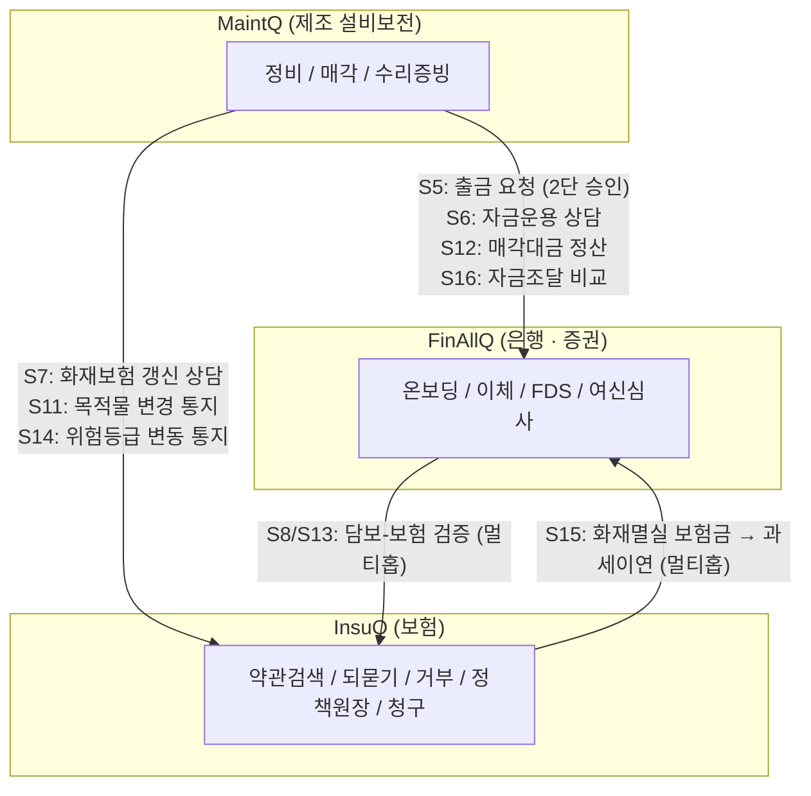

> ⚠️ 세 변 모두 **A2A 창구가 아직 없다** — 위 화살표는 "계약(스키마·Agent Card)은 확정됐고 데이터·로직도 상당수 준비됐지만, HTTP로 실제로 오가지는 않는다"는 뜻이다.

---

## ② MaintQ 안에서 벌어지는 일
> **관련 시나리오**: S1~S4, S9, S10, S17, S18, S29 (+ F5·F6 내부 감시 계층)
> **담당**: 정비사 · 공장 팀장 화면

### 1. 진단 → 발주 흐름 (`S1`, `S2`, `S3`, `S4`)
- **기본 레일**: `에러코드 진단` ▶ `부품 확인` ▶ `재고·견적 확인` ▶ `발주서 초안` ▶ `팀장 승인`
- **분기 조건**:
  - **재고가 0인 경우 (`S2`)**: 대체 부품 탐색 및 비교 레일 실행
  - **30일 내 동일 고장 3회 (`S3`)**: 단순 부품 교체가 아닌 진짜 원인 점검 모드로 전환
  - **모르는 에러코드 (`S4`)**: 환각 없이 "모른다"고 인정 후 A/S 센터 안내

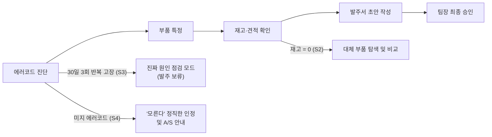

### 2. 설비를 팔 때 (`S9`, `S10`)
- **매각 요청** ▶ **법적 조건 확인** (세금·담보 등)
  - 막히면: 단순 거절이 아니라 이유 + 해결방법 함께 안내 (`S9`)
  - 문제 없으면: **근거 자료 모으기** (법 조항 + 실사 데이터) ▶ **담당자 서명** (책임 귀속, `S10`)

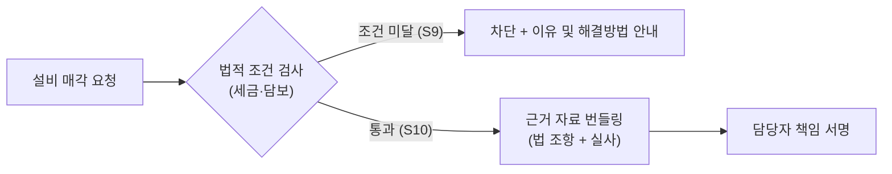

### 3. 법이 바뀌면 (`S17`)
- `법령 개정 감지` ▶ `자동 반영 차단 (담당자 안내)` ▶ `담당자 확인 후 규칙 갱신` (과거 서명 건은 그대로 유지)
- 진행률 70% — 수집·대조는 완료, 도구 노출(v2)은 범위 밖.

### 4. 중고 설비를 살 때 (`S18`)
- `중고 설비 매입 검토` ▶ `소유권/권리관계 확인 (9카테고리 38항목 실사)` ▶ `확인된 것과 불확실한 것을 명확히 구분 표시` — **전건 PARTIAL이 정답**(등기가 없어 완전 확인은 원래 불가능).

### 5. 설비를 고쳤을 때 (`S29`) — ✅ **번호 확정** (Sprint 12, D98)
- `수리 완료` (부품·시리얼·작업유형) ▶ `증빙 초안 작성` (`create_repair_record`, draft만) ▶ `담당자 서명` (`POST /api/repairs/{id}/sign`) ▶ `불변 증빙 기록 저장` (TEMP TRIGGER)
- **통합 승인 큐**: 발주·처분·수리 3종을 `kind` 필드 하나로 단일 큐에서 관리.
- **제약**: 본인 수리건 본인 서명 불가, 미서명 기록은 보전지표 제외.

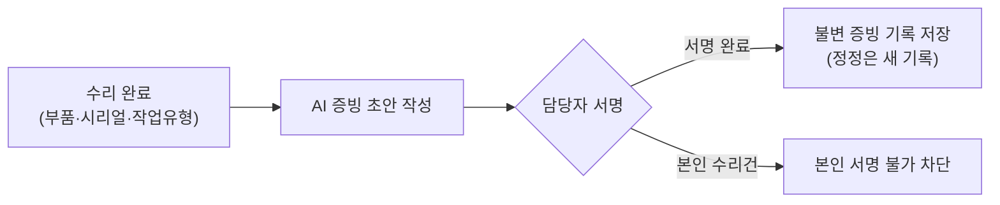

### 6. 🆕 기한 · 사고 · 위험 감시 (`F5`, `F6`) — Sprint 11 완료 (D102)
- `기한 감시(F5, track_deadlines)` ▶ `사전 경보 발행(임박/초과)` ▶ `위험등급 산정(F6, assess_risk_grade)` ▶ `A2A 연계 준비 — InsuQ 리스크 산정 근거 제공`
- **이 계층이 S7·S14(보험 위험 평가)의 핵심 근거가 된다.**

### 7. 🆕 진단 대상 기종 확장 — Sprint 14 완료 + Sprint 15(계획 완료 가정)
- 기존 `iG5A`·`S100` 2기종 전용이던 진단 흐름에 **3번째 표준 매뉴얼(IE5)**를 편입 중. Sprint 14가 트립 코드 5종(과전류·인버터 과부하·냉각핀 과열·과전압·저전압)을 실추출·사람 검수까지 완료했다.
- ⚠️ **Sprint 15(P11)는 계획 단계다.** `model` enum 확장·정본 병합·회귀 갱신까지 PM 스테이지 계획은 나왔지만 **실제 코드는 아직 없다.** 안전 경고 문구(매뉴얼 근거 미검증)·RAG 절차 조회(청킹 미착수)·실물 설비 등록은 의도적으로 이번 확장 범위 밖.

> 🔗 **연결점**: S10 서명 완료 시 S11(보험사 통지) 및 S12(정산 요청)로 연결. S18 대출 필요 시 S13(멀티홉)으로 연결. **S29 증빙은 S10 매각 근거와 S7 화재보험 갱신에 보내는 고장이력의 원천**이다. **F5·F6 감시 계층은 S7·S14 보험 위험 평가의 핵심 근거**가 된다.

---

## ③ FinAllQ 안에서 벌어지는 일
> **관련 시나리오**: 내부 S19~S23 / 경계 S5, S6, S8, S12, S13, S15, S16
> **담당**: 은행 · 증권 담당자 화면 (이상거래 탐지 FDS 내장)
> 🟢 **세 프로젝트 중 가장 많이 구현됨** — Sprint 1~14 완료, Sprint 15 진행 중.

### 1. 🟢 기업 고객 온보딩 (`S19`) — *내부 완결*
- `기업 등록` (사업자번호) ▶ `앵커 초대 발급` (은행이 첫 결재자 지정) ▶ `초대 수락` ▶ `직원 초대`
- 발급자 lockout 처리(단일 앵커 권한 회수 차단)까지 완비.

### 2. 🟢 이체 및 결재 전체 흐름 (`S20`, `S21`) — *내부 완결*
- `이체 요청` ▶ `결재자 판정` (개인=본인, 기업=MANAGER) ▶ `규칙 관문` (한도) ▶ `이상거래 탐지 (FDS)` ▶ `잔액 차감 실행`
- **통제 규칙**: 본인 요청 본인 결재 금지, 관리자(ADMIN)의 결재 권한 배제, 타 사 리소스는 "권한 없음"이 아니라 **존재 자체를 숨김**.

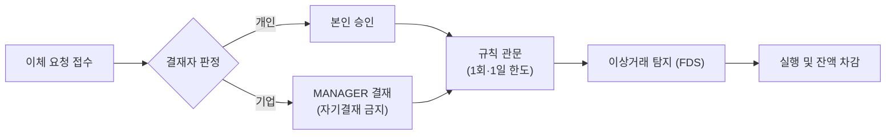

### 3. 🟢 AI 비서 오케스트레이션 (`S22`, `S23`) — *내부 완결*
- `자연어 질문` ▶ `실행 기능 결정` (🔴 LLM 아님, 규칙 기반) ▶ `MCP 툴 20종 실행` ▶ `답 조립 + 근거 패널 노출`
- **특징**: 일부 기능 장애 시 조용히 숨기지 않고 배너 노출 (Fail-soft). S23(통합 자산·리포트)은 계산 로직은 완료됐으나 데이터가 합성값이라 70%.

### 4. 🆕 대출(여신) 심사 — Sprint 12 → 14 → 15로 단계적 진전
- `담보대출 요청` ▶ `담보 가치 평가(LTV)` ▶ `InsuQ 보험 유효성 검증(2차 홉, 대기)` ▶ `심사 결정(승인/자동거절/사람거절)`
- **Sprint 12**: 여신 심사 핵심 API 4종 — 한도·LTV 자동 판정 도메인 완비.
- **Sprint 14**: 자동거절도 이력이 된다 — 거절 시 사유코드·메모와 함께 저장, 자기결재 사전 차단.
- **Sprint 15(진행 중)**: 심사자가 근거(한도·담보·LTV 실데이터 카드)를 보고 결정 — 신규 데이터 없이 기존 값 재구성만.

### 5. 경계를 넘는 요청 (A2A 미구현 영역)
- **돈 이동 요청 (`S5`, `S12`)**: MaintQ 요청 접수 ▶ FDS 검사 ▶ 재무 담당 승인 ▶ 실행/거절
- **상담 요청 (`S6`, `S16`)**: 접수 ▶ 비용/위험 분석 ▶ 방안 비교표 작성 ▶ 회신 (거래 미실행) — **분석 로직 자체가 아직 없음**
- **대출 심사 (`S8`, `S13`)**: 담보대출 요청 ▶ 담보 평가 ▶ InsuQ 보험 확인 조회 ▶ 조건부 승인 — **도메인은 완비, InsuQ 쪽 상대 창구가 있어야 릴레이 완성**

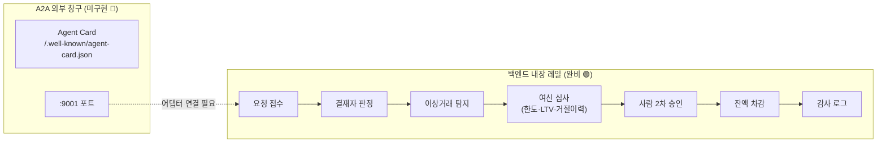

> 🔑 **핵심 관찰** — S5 처리 레일(S20 결재 + S21 FDS + 감사로그)과 S8의 여신 심사 도메인(Sprint 12·14·15)은 **이미 다 깔려 있다.** 빠진 것은 흐름이 아니라 **바깥으로 난 문**(Agent Card·`:9001`)이다.
>
> ⚠️ **2026-08-20 재확인 — "사람 계정이 존재하는 것"과 "A2A가 그 회사를 인증하는 것"은 다르다.** 기업 등록·직원 초대·발급자 lockout(126~130)은 완료됐지만, **파트너 자격증명 발급·연결 승인(백로그 131·132, 머신 신원)은 여전히 미착수**다. JWT 클레임에도 아직 `company_id`가 없어 회사 스코프는 매 요청 DB 재조회로 얻는다 — A2A 어댑터를 짤 때 "파트너 토큰 → company_id" 매핑을 어디서 할지가 새로 정할 결정 지점이다.

---

## ④ InsuQ 안에서 벌어지는 일
> **관련 시나리오**: 내부 S24~S28 / 경계 S7, S8, S11, S13, S14, S15
> **담당**: 보험 상담 · 청구 처리
> **원칙**: 약관에 없으면 "확인 불가"로 답변하며 추측성 답변 금지.

### 1. 🟢 근거 기반 약관 상담 및 검증 (`S24`~`S28`) — *내부 완결*
- **기본 파이프라인**: `질문 접수` ▶ `라우터` ▶ `검색` (조·항 단위) ▶ `참조 조항 추적` ▶ `인용 검증` ▶ `판정 3단계` (높음/낮음/유보)
- **세부 통제**:
  - **정보 부족 (`S25`)**: 상품·특약·가입시기 되묻기 실행 (`input-required` 대응)
  - **근거 없음 (`S26`)**: "약관에서 확인 불가" 거부 (범위 밖 6문항 100% 거부 검증)
  - **조항 불일치**: 인용 항 번호 오류 시 판정을 유보로 강등
  - **멀티홉 조항 추적 (`S27`)**: 같은 파트 스코핑으로 인용 근거 수를 46건에서 7건으로 압축
  - **화재·재물 도메인 (`S28`)**: 트랙4 코퍼스 2,214청크·골든셋 66문항·Hit@5 0.6538, **상품 단위 스코핑까지 브라우저 검증 완료**

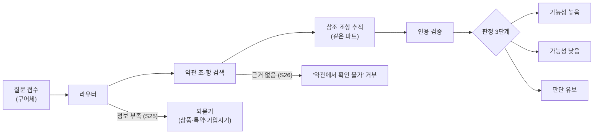

### 2. 🆕 가상 고객 정책 원장 — Sprint 10 구축, Sprint 12 실기동 검증
- `고객별 가입 보험 조회(5엔티티 원장)` ▶ `검색 범위 자동 공급` ▶ `근거 자동 인용`
- Sprint 12에서 **3층 전체가 `docker compose up` 하나로 기동**하고 **prod 스키마 마이그레이션(9테이블)이 실기동 검증**됐다.
- **2026-08-19 브라우저 검증(VER-9·VER-10 전항목 통과)**: 고객 상세에서 상품을 고르지 않아도 근거 6/7건이 전부 해당 상품 약관이었고, 같은 답변이 판정(유보)·단정 금지 문구·조항 인용·"확인하지 못한 조항" 명시를 **동시에** 냈다 — A2A 회신이 실제로 넘겨줄 모양이 이거다.

### 3. 경계를 넘는 연계 요청
- **약관 상담 (`S7`, `S11`, `S14`)**: MaintQ/FinAllQ 요청 접수 ▶ 조항 검색 ▶ 근거와 함께 답변
- **보험 확인 요청 (`S8`, `S13`)**: FinAllQ 대출 심사 시 **원장 조회(완비)** ▶ **보장액 계산(비례보상 로직은 미구현)** ▶ 회신
- **사고 청구 (`S15`)**: 사고 접수 ▶ 보험금 계산(미구현) ▶ 지급 결정 ▶ FinAllQ 자금 상담 전달

### 4. 🆕 스킬 5종을 막던 원인이 바뀌었다

| 스킬 | 시나리오 | 기대 기능 | 지금 상태 | 남은 것 |
|---|---|---|---|---|
| `advise-policy-renewal` | S7 | 화재 약관 RAG + 계약 대장(만기·가입금액) | 코퍼스·원장·스코핑·브라우저 검증 완료 | **갱신 요율/보험료 산출 로직 없음** |
| `verify-collateral-insurance` | S8·S13 | 원장 조회 + 비례보상 계산 | 원장 완비, 조회가 화면까지 도달 | **비례보상 계산 로직 자체가 미구현** |
| `notify-asset-change` | S11 | 자산↔계약 연결 + 갱신 판단 | 대장만 있음(읽기 전용 시드) | 수신·판단 로직 전부 |
| `notify-risk-change` | S14 | 리스크 재평가 트리거 + RAG 근거 | RAG만 있음 | **위험등급 개념이 데이터 모델에 아예 없음** |
| `claim-insurance` | S15 | 지급 판정 + `input-required` + 승인 큐 | 판정 원칙(3단계·단정금지)만 준비 | 보험금 산정 로직 + 승인 큐 화면 |
| 🆕 `lookup-clause` (제안) | — | 약관 코퍼스+검색+인용+거부 | **코어 완비**(Hit@5 0.8148·거부 1.0·과잉거부 0.0) | 창구만 — 계약(스키마)도 아직 없음 |

> **읽는 법** — 이전엔 "전부 정책 원장에 막혀 있다"가 맞았지만 지금은 원장이 있고 화면까지 닿는다. 남은 병목은 셋: ① **공통** HTTP 창구 ② **계산** 비례보상·보험금 산정 로직 ③ **데이터 모델 자체가 없는 것**(위험등급·자산변경) — ③이 가장 비싸다.

> 🔗 **연결점**: S7·S11·S14는 MaintQ↔InsuQ 선, S8·S13은 FinAllQ가 중간에서 다시 묻는 FinAllQ↔InsuQ 선, S15는 유일하게 InsuQ가 먼저 시작해 FinAllQ로 넘기는 반대 방향이다.

---

## ⑤ MaintQ 구현 현황 · 성능

### 📊 수치 현황 (2026-08-20 실측, Sprint15는 계획완료 가정)
- **완료 스프린트**: 15개 (M1~M4 + Sprint 5~15, Sprint15는 계획완료 가정)
- **MCP 도구**: 18개 (코어 7, 확장 11)
- **UI 라우트**: 18개
- **지원 기종**: 3종 (iG5A·S100·IE5, D109 가정)
- **회귀 단언**: 1,095개 이상 (32스위트 976 + seed 36 + pytest 83)
- **설계 결정**: 108개 (D1~D108)
- **DB 테이블**: 24개 (코어 11 + 확장 13)
- **법령 조문 실수집**: 8/8 (8,197자)
- **A2A 창구**: 0개 (미착수)

> ⚠️ **Sprint 15(IE5 기종 편입)는 계획 단계다.** 위 "3종"·"D109"·회귀 단언 총계는 그 계획이 그대로 실행됐다는 가정이며, 실제 코드는 아직 없다.

### 📋 시나리오별 진행 상황
| 시나리오 ID | 시나리오 내용 | 진행률 | 상태 및 비고 |
| :--- | :--- | :---: | :--- |
| **S1** | 진단 → 재고 → 견적 → 발주서 초안 → 승인 | 100% | 구현 완료 |
| **S2** | 재고 0 → 대체품 탐색 · 비교 | 100% | 구현 완료 (D12 게이트 해제) |
| **S3** | 반복 고장(30일 3회) → 근본원인 모드 | 100% | 구현 완료 (시퀀스 준수 100%) |
| **S4** | 미지 코드 → 모른다 인정 | 100% | 구현 완료 (환각률 0.0%) |
| **S9** | 처분 요청 → 법정조건 차단 | 100% | 구현 완료 (판정 5종 전수) |
| **S10** | 근거 번들 → 담당자 서명 | 100% | 구현 완료 (4층 방어) |
| **S18** | 중고 매수 권리관계 검증 | 100% | 구현 완료 (전건 PARTIAL이 정답) |
| **S29** | 수리 완료 → 증빙 서명 | 100% | ✅ 구현 완료·**번호 확정**(Sprint 12, D98) |
| **F5·F6** | 기한·사고·위험 감시 계층 | 100% | 구현 완료 (Sprint 11, D102) |
| **S17** | 법령 개정 감지 → 룰 갱신 | 70% | 수집/대조 완료, 도구 노출(v2) 범위 밖 |
| **S5** | 출금 요청 (MaintQ → FinAllQ) | 35% | 발신 신원 레이어 구현, 창구 미비 |
| **S7** | 화재보험 갱신 (MaintQ → InsuQ) | 30% | 고장이력 데이터 완비, 창구 미비 |
| **S11·S14**| 목적물/위험등급 통지 | 10% | 미착수 |
| **S12·S16**| 매각대금 정산/자금조달 비교 | 8% | 미착수 |
| **S13** | 중고설비 취득 담보심사 (멀티홉) | 8% | 미착수 (3자 필요) |

---

### 🔬 MaintQ 평가 5지표 및 튜닝 판정 결과

#### 1. 평가 5지표 실측 (목표 대비)
1. **시퀀스 제약 준수**: **100.0%** (15/15) — *목표 100% 달성*
2. **미지 코드 환각률**: **0.0%** (0/6) — *목표 0% 달성*
3. **근거 페이지 인용률**: **92.6%** (50/54) — *목표 100% 미달 (남은 4건은 흔들림 칸)*
4. **안전 경고 누락률/포함률**: **81.5%** (44/54) — *목표 100% 미달*
5. **부품 특정 정확률**: **40.0%** (18/45) — *목표 90% 대비 -50pt 미달 (원인: 매뉴얼 내 부품 품번 미공개 데이터 한계)*

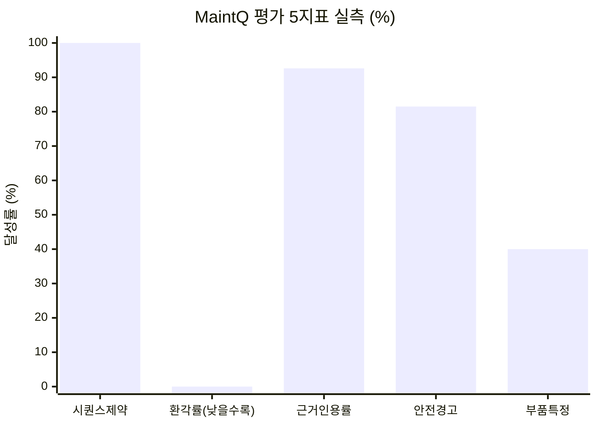

#### 2. 튜닝 후보 5종 평가 판정 (안정 전이 분석)
- **후보 A (프롬프트 - S2 교체 RAG 요구)**: **채택** (승격 +1, 회귀 0)
- **후보 A′ (프롬프트 - 재조회 금지)**: **기각** (승격 0, 회귀 -1)
- **후보 B (프롬프트 - 품번 재특정)**: **기각** (합산 비율은 92.6%로 올랐으나 전이는 0이고 안전경고 회귀 -1 발생)
- **후보 C (코드 - 안전블록 발행 조건 확대)**: **채택** (승격 +1, 회귀 0)
- **MQ-714 (코드 - 중복 호출 루프 통제)**: **원복** (표적 문항 성능 악화로 기각)

#### 3. 🛠 MaintQ 적용 주요 기법 (14종)
1. **네이티브 Tool-Use 루프**: 프레임워크 없이 직접 제어 (상한 턴당 8 / LLM 10 / 세션 50), 재시도 없음
2. **Strict Provider Fail**: API 키 부재 시 폴백 없이 즉시 실패 처리
3. **도구 역할 분리**: Exact-Match 복합키 룩업과 RAG 도구 명확 분리
4. **TF-IDF + 한글 바이그램 RAG**: 재현성 확보를 위해 벡터스토어 미사용
5. **상수 기반 안전 경고**: LLM이 경고 문구를 생성하지 않고 매뉴얼 원문 직접 사용
6. **타입 분리 거부**: `not_found` 명시적 타입 반환으로 추측 차단
7. **TEMP TRIGGER 기반 쓰기 제어**: DB 커넥션 레벨 권한 통제 (INSERT 3건만, UPDATE/DELETE 0건)
8. **4층 확정 방어**: 권한 ▶ 스키마 ▶ 순서 ▶ DDL CHECK 제약
9. **근거 3계층 + 해시 대조**: 법령 ▶ 해석 룰 ▶ 서명 번들 해시 재검증
10. **Audit-Log 기반 통제**: 무조건적 차단 대신 우회 기록 남김 ("막지 않는다. 뚫은 사람을 기록한다")
11. **양성 축 통합 검증**: 정규식 스캐너 비활성화 감지용 양성 검증축 동시 운용
12. **3회 반복 측정 및 흔들림 분리**: 단일 실행 평가 차단 및 안정통과/실패 구분
13. **🆕 외부 응답은 파일이 정본, DB는 사본**: `data/raw/external/`에 응답 본문만 allowlist로 git 추적(D103) — 2026-08-13 평문 자격증명 유출(`git filter-repo` 재작성) 이후의 구조적 방지책
14. **🆕 2차 판독기는 정답지가 아니다**: `actions` 결측 34건을 재판독해 확정 24·불일치 6·모호 4·회수 0건으로 판가름(D105) — "없다"가 근거를 갖고 확정되는 것도 유효한 산출

> ⛔ **「게이트가 열린 것」과 「지표가 좋아진 것」은 다른 일이다.** 2026-08-12에 related_parts 8건 사람 승인이 떨어져 부품 특정 지표가 「판정 불가」 → 「미달 40.0%」가 됐는데, 숫자는 1포인트도 움직이지 않았다. 승인이 바꾼 것은 값이 아니라 그 값을 실적으로 인용할 자격이다.

---

## ⑥ FinAllQ 구현 현황

### 📊 수치 현황 (2026-08-20 실측)
- **완료 스프린트**: 14개 (Sprint 15는 Stage 1 완료, 진행 중)
- **REST 엔드포인트**: 59개 (초대·기업등록 포함)
- **실제 화면**: 31개 (React 19)
- **에이전트 툴**: 20개 (전수 화면 연결 완료)
- **자동 테스트**: 1,300개 이상 (백엔드 831 · 프론트 391 실측)
- **DB 테이블**: 20개 (여신 3종 포함)
- **A2A 창구**: 0개 (미착수)

### 📋 시나리오별 진행 상황
| 시나리오 ID | 시나리오 내용 | 진행률 | 상태 및 비고 |
| :--- | :--- | :---: | :--- |
| **S19** | 기업 고객 온보딩 | 100% | 구현 완료 |
| **S20** | 이체 요청 → 결재 → 실행 | 100% | 구현 완료 (18칸 직무분리 매트릭스) |
| **S21** | 이상거래 탐지 · 경보 | 88% | 구현 완료 (FDS 모델은 난수 학습 데이터) |
| **S22** | AI 비서 오케스트레이션 | 100% | 구현 완료 |
| **S23** | 통합 자산 · 리포트 | 70% | 계산 로직 완료 (합성 데이터 상태) |
| **S5** | 출금 요청 (2단 승인) | 75% | 내부 레일 완료, A2A 접수 창구 없음 |
| **S8·S13**| 담보-보험 검증 (여신 심사 도메인+거절이력+근거화면) | 62% | S12·S14 완료·S15 진행 중, A2A 대기 |
| **S6** | 환헤지 · 자금운용 상담 | 15% | 미착수 (분석 로직 필요) |
| **S12·S16**| 매각대금 정산/자금조달 비교 | 8% | 미착수 |

---

### 🏗 FinAllQ 구조 및 설계 원칙

#### 1. S5·S8 준비 현황
- **완비된 요소**: 계좌 검사 ▶ 결재자 판정(MANAGER) ▶ 규칙 관문 ▶ FDS 검사 ▶ 잔액 차감 ▶ append-only 감사 로그 (테스트 1,300+건 통과), 여신 한도·LTV 자동판정 + 거절 이력화
- **부족한 요소**: 외부 요청 접수용 Agent Card 및 `:9001` 포트 어댑터, 심사 근거 화면(Sprint 15 진행 중), InsuQ 상대 창구

#### 2. 시스템 아키텍처
- **단일 진입점**: Nginx (`:3002`, 프론트 컨테이너)
- **Core-AI 분리**: Spring Boot (Core) ↔ FastAPI (AI FDS) 간 **차단기(Circuit Breaker)** 배치로 AI 장애 전이 차단
- **MCP Hub**: LangGraph 기반 툴 20종 운용, 사용자 JWT 재주입을 통한 권한 제어

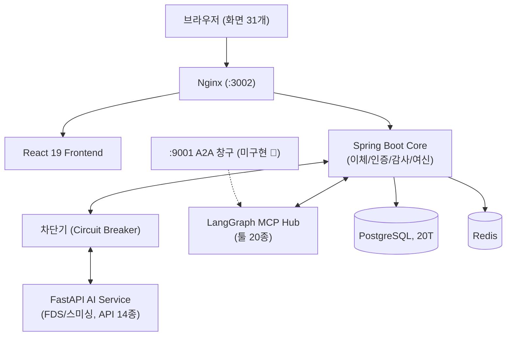

#### 3. 🛠 FinAllQ 적용 주요 기법 (14종)
1. **LangGraph 상태 그래프**: 노드별 실행 추적성 확보 (계획은 규칙, 조립은 템플릿 사용)
2. **화이트리스트 데이터 차단**: 외부 전송 페이로드 필드 명시적 등재 관리
3. **이중 방어 (규칙 → FDS)**: 한도 규칙 우선 검증 후 AI 모델 호출
4. **18칸 직무 분리 매트릭스**: 요청자-승인자 분리 및 관리자 금전 승인권 배제
5. **전이 기반 권한 가드**: 역할 추가 시에도 유지되는 전이 범위 검증
6. **Append-Only 감사 로그**: 성공/실패 시도 전수 기록
7. **토큰 보안 분리**: Access(메모리) / Refresh(HttpOnly Cookie) 분리
8. **서버 고정 권한 구조**: 초대 요청 본문의 권한 파라미터 무시
9. **명시적 타임존 지정**: `Clock` 주입 및 타임존 미지정 부팅 차단
10. **Testcontainers & Test-Shuffle**: DB 격리 및 프론트엔드 테스트 무작위 셔플
11. **Flyway 롤포워드**: 기존 마이그레이션 수정 금지 및 체크섬 고정
12. **Fail-soft 알림 배너**: 모듈 장애 시 기능 차단 및 명시적 표시
13. **🆕 판정 일관성 — 쓰기·읽기가 판정 로직 공유**: 여신 자동거절(신청 시점)과 심사 근거 재조회(화면 표시)가 같은 순수 static 헬퍼 사용(Sprint 15) — "신청 땐 거절인데 화면엔 통과" 같은 DB/화면 불일치 방지
14. **🆕 재조회 전 캐시부터 본다**: 목록 화면에서 상세를 N건 미리 긁지 않고 펼친 행 1건만 조회 후 캐시 — 신규 라이브러리 0개, 기존 컴포넌트 재사용이 기본값

> **A2A로 가려면 남은 일** — ① Agent Card로 `request-withdrawal`·`assess-loan` 같은 스킬 선언 ② `:9001` 얼굴 포트 + 기존 REST 흐름 연결 어댑터 ③ `input-required`(승인 대기)를 **기존 결재함에 매핑**(🟢 개념은 이미 있음) ④ `request_chain_id`를 감사 로그에 추가.
> 🟡 **머신 신원(파트너 자격증명·연결 승인)은 여전히 손도 안 댔다** — 백로그 131·132, QMesh 착수 확정 전까지 보류.

---

## ⑦ InsuQ 구현 현황 · 성능

### 📊 수치 현황 (2026-08-19 실측, 커밋 `9851de1`)
- **완료 스프린트**: 12개
- **REST 엔드포인트**: 22개 (Spring 18 · ai 4)
- **실제 화면**: 6개 (설계사 고객관리 포함)
- **자동 테스트**: 875개 (ai-engine)
- **골든셋 문항**: 96개 (트랙1 30 + 트랙4 66)
- **실험 기록 (EXP)**: 52개
- **가상 고객 원장**: 5엔티티 (Sprint 10 시드)
- **A2A 스킬 계약**: 5종 (Agent Card + 스키마 전부 존재)
- **A2A 창구 (HTTP 노출)**: 0개 (최대 병목)
- **전체 기능 구현 범위**: **53% (59/112)**

> **계약은 이미 있다. 없는 건 창구다.** `A2A_Q/docs/agent_cards/insuq.json`에 스킬 5종이 선언돼 있고 `docs/schemas/`에 request/response 스키마 5개 파일이 전부 존재하지만, InsuQ 레포 소스 전체에서 `a2a`·`agent-card`·`json-rpc` 매치는 **0건**이다. 수신부 위치는 확정(Spring/backend — ai-engine엔 RDB 커넥션을 두지 않는 경계 때문). 백로그 `TASK-H01`~`H06` 6건 전부 미착수.

### 📋 시나리오별 진행 상황
| 시나리오 ID | 시나리오 내용 | 진행률 | 상태 및 비고 |
| :--- | :--- | :---: | :--- |
| **S24** | 약관 근거 상담 | 100% | 구현 완료 (근거 조항 인용 + 3단계 판정) |
| **S25** | 정보 부족 → 되묻기 | 100% | 구현 완료 (슬롯 3종 되묻기) |
| **S26** | 근거 없음 → 거부 | 100% | 구현 완료 (범위 밖 6/6 거부) |
| **S27** | 멀티홉 조항 추적 | 100% | 구현 완료 (근거 46건 → 7건 압축) |
| **S28** | 화재·재물 도메인 (트랙4) | 75% | 브라우저 검증 통과 (Hit@5 0.6538) |
| **S8·S13**| 담보-보험 검증 (멀티홉) | 50% | Sprint 10 원장 완비, A2A 대기 (비례보상 로직 없음) |
| **S7** | 화재보험 갱신 상담 | 45% | 코퍼스·원장 완비, 요율 엔진 없음 |
| **S11·S14**| 목적물/위험등급 통지 | 10% | 미착수 (위험등급 데이터 모델 자체가 없음) |
| **S15** | 화재멸실 보험금 산정 | 10% | 미착수 |
| **신규** | 🆕 `lookup-clause` 스킬 제안 | 75% | 코어 엔진 완비, 계약(스키마)·창구 없음 |

> 💡 **`lookup-clause` 신규 제안 사유**: 5종의 병목이 원장에서 창구·계산 로직으로 옮겨간 지금도, 원장 없이 약관 코퍼스만으로 즉시 작동 가능한 이 스킬은 여전히 A2A 최우선 검증 후보다.

---

### 🔬 InsuQ RAG 검색 성능 측정 데이터

#### 1. 트랙1 (실손) 검색 기법 비교 (Hit@5)
- **vector only (기준선)**: Hit@5 **0.8333** / p50 **0.434s**
- **BM25 + 벡터 RRF**: Hit@5 **0.7917** — *기각 (형태소 미처리 및 중복 조문 문제)*
- **bge-reranker-v2-m3**: Hit@5 **0.8750** / p50 **98.2s** — *조건부 기각 (CPU 속도 실격)*
- **mmarco (경량 리랭커)**: Hit@5 **0.7500** / p50 **4.27s** — *기각 (기준선 대비 하락)*
- **완전중복 청크 병합**: Hit@5 **0.8333** — *무효과*
- **HyDE average**: Hit@5 **0.9167** / p50 **5.477s** — **✔ 최종 채택**

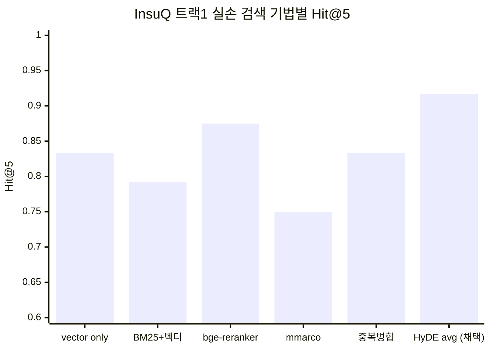

#### 2. 트랙4 (화재·재물) 검색 기법 비교 (Hit@5)
- **vector (기준선)**: Hit@5 **0.6346** / p50 **0.540s**
- **HyDE replace**: Hit@5 **0.7442** / p50 **0.640s** — *비용 대비 우수*
- **HyDE average**: Hit@5 **0.7907** / p50 **6.585s** — *품질 1등이나 30초 레이턴시 예산 부담으로 보류*
- 상품 단위 스코핑 적용 후 현재 서빙 기준 Hit@5 **0.6538**, 2026-08-19 브라우저 검증 통과.

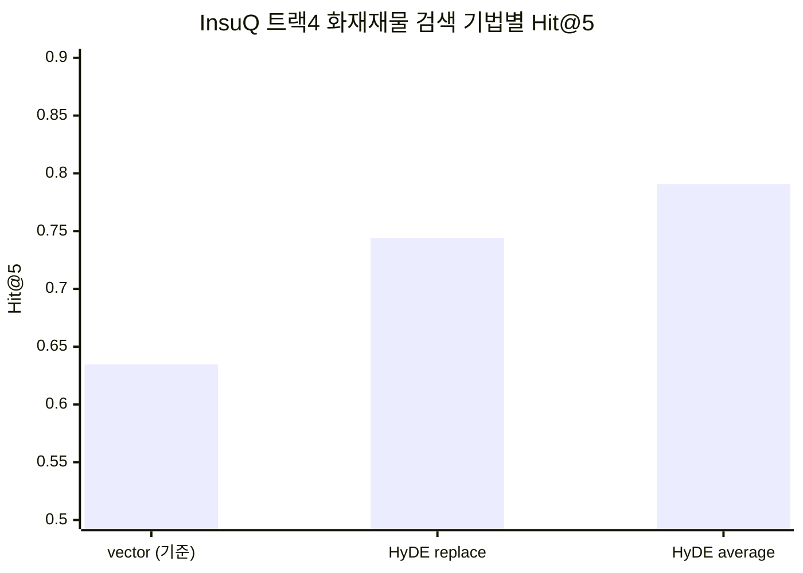

#### 3. 🛡 InsuQ 내장 안전장치 (5종)
1. **인용 대조 키 고정**: `(policy_part, article_no)` 파트 명시 필수화
2. **단정적 표현 금지**: "지급 가능" 대신 "가능성 높음/낮음/유보" 3단계 강제
3. **약관 근거 미비 거부**: 근거 없으면 "약관에서 확인 불가" 출력 (과잉 거부율 관리)
4. **사람 중심 골든셋**: 헤드라인 세트 정답 태깅은 오직 사람이 수행
5. **Judge 일치율 검증**: LLM 채점기 도입 전 사람 채점과의 일치율 사전 검증

> InsuQ의 규칙은 하나다 — **모든 기법은 전/후 숫자와 함께 커밋한다.** 채택한 기법만큼 기각한 기법도 같은 무게로 기록된다(EXP-050~052 등, 측정 해상도·과잉거부 반대 함정 사례 포함).

---

## ⑧ 용어 사전

- **A2A (Agent to Agent)**: 서로 다른 프로젝트(=회사)의 AI 에이전트 간 직접 통신 및 연계 처리.
- **멀티홉 (Multi-hop)**: A ▶ B ▶ C 형태로 여러 에이전트를 거쳐 복합적인 과업을 처리하는 구조.
- **2단 승인**: 금전 출금 전 공장 관리자와 은행 담당자가 각각 승인하는 절차.
- **Human-in-the-loop**: AI는 초안 및 분석만 수행하고 최종 결정/서명은 사람이 수행하는 원칙.
- **FDS (Fraud Detection System)**: 이상거래 탐지 시스템.
- **RAG (Retrieval-Augmented Generation)**: 외부 매뉴얼/약관 문서를 검색하여 근거로 활용하는 기술.
- **request_chain_id**: 다자간 멀티홉 연계 시 최초 요청 발신처를 추적하는 고유 식별자.
- **비례보상**: 실제 재물 가치 대비 보험 가입 금액의 비율만큼만 손해를 보상하는 원칙.
- **승인 큐**: 사람의 서명 및 승인을 기다리는 작업 대기열.
- **근거 3계층**: ① 법령/약관 원문(불변 사실) ▶ ② AI 해석 룰 ▶ ③ 사람 서명 번들의 계층 분리.
- **담보**: 대출 채무 불이행 시 채권 확보를 위해 설정하는 재산.
- **근저당**: 담보 재산에 설정하는 우선 변제권 법적 표시.
- **Agent Card**: 에이전트의 수행 가능 스킬을 명시한 공개 명함 (`/.well-known/agent-card.json`).
- **앵커 (Anchor)**: FinAllQ에서 기업 고객 등록 시 은행이 지정하는 최초 결재 권한 보유자.
- **결재 라인**: 기업 내 금전 승인 권한 분리 규칙.
- **차단기 (Circuit Breaker)**: 연동 서비스 장애 시 호출을 일시 차단하여 전체 시스템 다운을 방지하는 패턴.
- **화이트리스트 차단**: 명시적으로 허용된 키/필드만 통과시키는 보안 방식.
- **LangGraph**: 에이전트의 작업 흐름을 그래프 노드로 표현 및 제어하는 프레임워크.
- **Fail-soft**: 일부 구성요소 장애 시 부분 기능을 유지하되 누락 사실을 명시하는 설계.
- **Hit@5**: 검색 상위 5개 결과 내 정답 조항 포함 비율.
- **골든셋**: 평가를 위해 사람이 정답을 달아둔 표준 문항 세트.
- **HyDE (Hypothetical Document Embeddings)**: 가상 답변/조문을 생성하여 검색 쿼리로 활용하는 확장 기법.
- **과잉 거부**: 답할 수 있는데도 거부해버린 비율 — 거부 정확도의 반대쪽 눈. 이것 없이 거부율만 올리면 아무것도 안 답하는 게 최적이 돼버린다.
- **측정 해상도**: 지표가 변화를 감지할 수 있는 최소 단위. 문항 수가 적으면 그보다 작은 개선은 노이즈에 묻혀 판정 불가하다.
- **정책 원장**: 고객별 가입 보험 계약 정보를 관리하는 핵심 대장 DB. **Sprint 10에서 가상 고객 원장(5엔티티)이 구축되고 Sprint 12에서 prod 스키마까지 실기동 검증**됐다 — 더 이상 "0"이 아니다.
- **레이턴시 예산**: 사용자 응답 보장 상한 시간 (InsuQ 30초 예산).
- **여신**: 은행이 심사해 빌려주는 신용(대출) 그 자체 — FinAllQ에서 담보·한도·LTV 판정을 거쳐 승인/거절이 결정된다.
- **파트너 자격증명**: A2A로 상대 회사를 인증하기 위한 머신 신원용 발급 토큰. 사람 계정(직원 초대 등)과는 별개 개념이며 FinAllQ에서 아직 미착수.

---

> **Q 시리즈 프로젝트 종합 문서**
> MaintQ · FinAllQ · InsuQ (기준 2026-08-20, InsuQ 파트만 2026-08-19)
