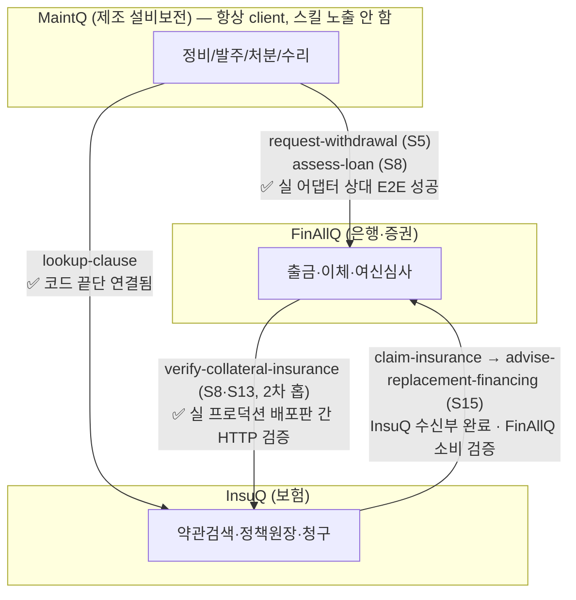
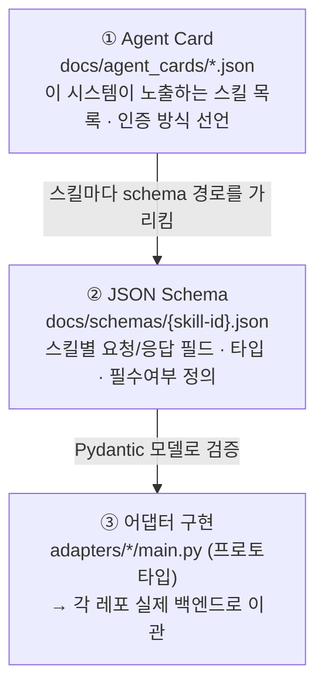
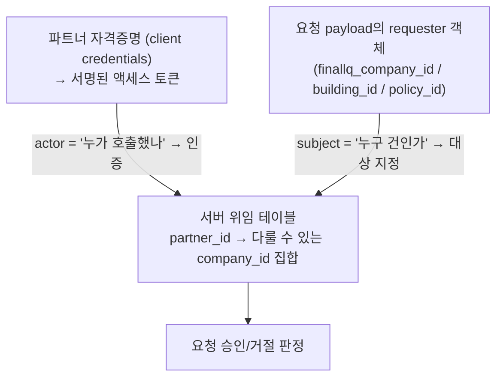
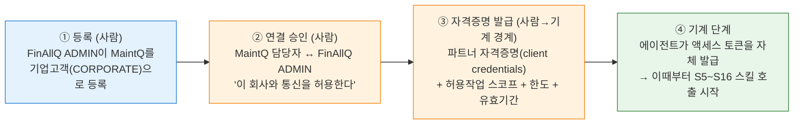
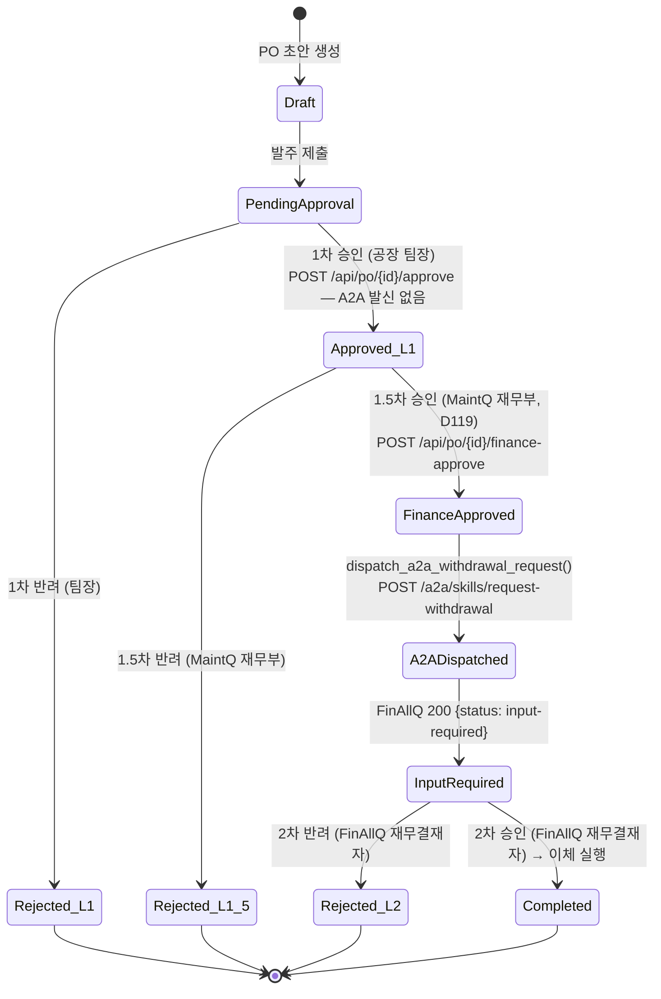
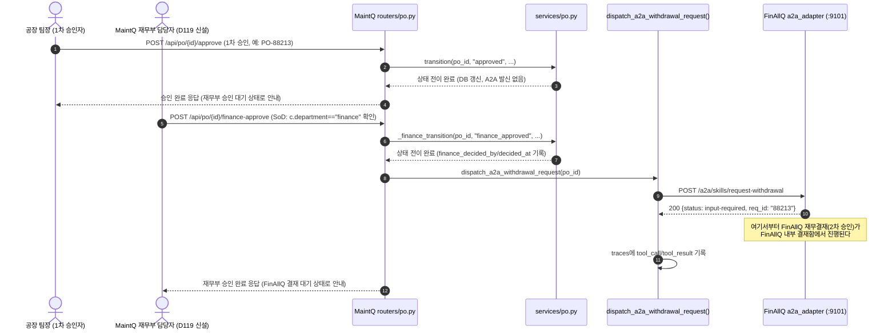
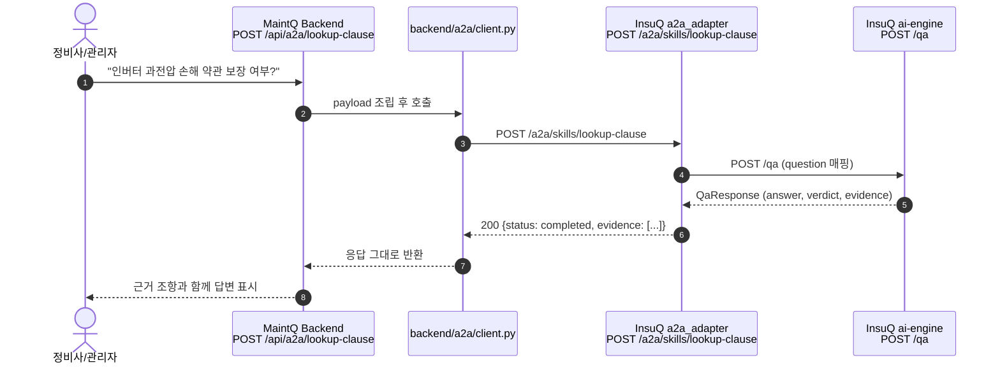
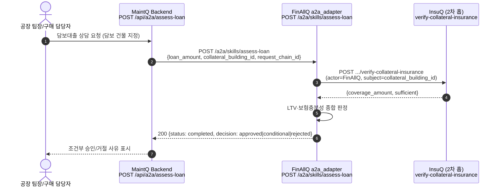
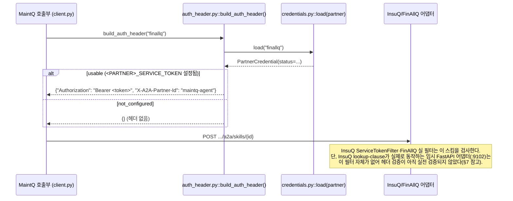
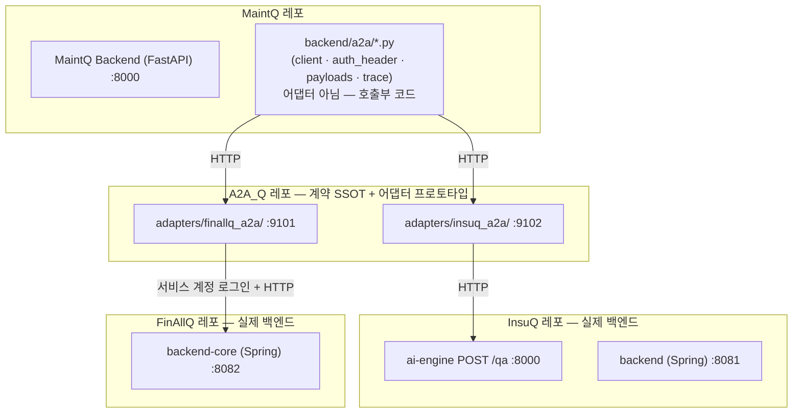

# A2A 계약 구조 & 데이터 흐름 — PPT 참고자료

**작성일:** 2026-08-24
**목적:** "A2A 계약을 어떻게 맺었는가" / "주고받는 데이터는 어떤 형태인가"를 PPT 슬라이드에 옮기기 위한 참고자료.
**범위:** FinAllQ · InsuQ 는 실측 코드 기준. **MaintQ는 아직 진행 중인 프로젝트라 개략만 다룬다.**
**근거 원본:** `docs/agent_cards/*.json`, `docs/schemas/*.json`, `docs/A2A_IDENTITY.md`, `A2A_DIAGRAMS.md`(v1.3), `tests/adapters/finallq_a2a/test_main.py`

---

## 목차

1. [한눈에 보기 — Q 시리즈 A2A 통신 구조](#1-한눈에-보기)
2. [계약을 어떻게 맺었는가](#2-계약을-어떻게-맺었는가)
3. [데이터는 어떤 형태인가](#3-데이터는-어떤-형태인가)
4. [통신 흐름도 — 시퀀스 & 승인 노드 흐름](#4-통신-흐름도)
5. [인증 헤더 흐름](#5-인증-헤더-흐름)
6. [소유권 · 포트 경계](#6-소유권--포트-경계)
7. [MaintQ 현황 (개략)](#7-maintq-현황-개략)

---

## 1. 한눈에 보기

Q 시리즈(제조보전 MaintQ · 은행/증권 FinAllQ · 보험 InsuQ)는 A2A(Agent-to-Agent) 프로토콜로 서로 다른 회사 경계를 넘어 통신한다. **MaintQ는 항상 요청을 시작하는 client**이고, FinAllQ·InsuQ는 스킬을 노출하는 응답자다. FinAllQ는 일부 시나리오(S8·S13)에서 InsuQ에 대해 2차 홉 요청자 역할도 겸한다.



**핵심 요약**

| 구분 | 내용 |
|---|---|
| **누가 요청을 시작하는가** | MaintQ가 유일한 client. FinAllQ·InsuQ는 스킬을 노출하는 응답자(단, FinAllQ는 2차 홉에서 InsuQ의 client가 되기도 함) |
| **계약의 형태** | Agent Card(스킬 목록·인증 방식 선언) + JSON Schema(스킬별 요청/응답 필드) 두 계층 |
| **계약이 어디에 있나** | 이 레포(`A2A_Q`)가 SSOT(Single Source of Truth) — `docs/agent_cards/`, `docs/schemas/`. 각 프로젝트 레포는 이 문서를 참조만 하고 복제하지 않는다 |
| **신원(누가 요청했는가)** | 파트너 자격증명(토큰) = 인증, 요청 payload의 식별자 = 대상 지정. 두 층을 분리 |

---

## 2. 계약을 어떻게 맺었는가

### 2.1 계약의 3계층 구조



- **Agent Card**: "이 회사가 무엇을 할 수 있는가"의 명함. `name`, `provider`, `authentication.schemes`, 그리고 `skills[]` 배열(각 스킬의 `id`·`scenario`·`schema` 경로)을 담는다.
- **JSON Schema**: 스킬 하나하나의 요청/응답 계약. `request.required`/`properties`, `response.properties`(상태값 enum 포함), 공통 `definitions.requester`로 구성된다.
- **어댑터 구현**: 스키마를 Pydantic으로 검증하고 실제 백엔드(Spring/FastAPI)로 연결하는 실행 계층. A2A_Q 레포의 `adapters/`는 프로토타입이며, 최종적으로는 각 프로젝트 레포가 자체 구현으로 흡수한다.

> **왜 SSOT를 A2A_Q에 두는가**: 계약이 여러 레포에 복제되면 한쪽만 고치고 다른 쪽을 잊는 drift가 생긴다. MaintQ의 `docs/ref_maintq/A2A_CONTRACTS.md`는 "실제 스키마 원본은 A2A_Q에 있고 여기서는 복제하지 않는다"를 명시적으로 못박아 이 문제를 막는다.

### 2.2 신원 모델 — "토큰(actor) + payload(subject)" 2층 분리

계약 설계 초기에는 "요청 payload에 회사 식별자만 담으면 된다"는 안이었으나, **식별자는 공개정보라 번호만 알면 남의 회사 건을 요청할 수 있다**는 문제로 폐기되고 아래 모델로 개정되었다(`docs/A2A_IDENTITY.md` 결정 1, 2026-08-13).



**핵심 원칙:** 식별자(subject) 존재 ≠ 인증. 실제 인증은 파트너 토큰(actor)이 하고, 서버는 "이 actor가 이 subject를 다룰 권한이 있는가"를 자체 위임 테이블로 검사한다. S8·S13(FinAllQ→InsuQ 2차 홉)은 actor(FinAllQ)≠subject(MaintQ 소유 건물)인 실제 사례다.

### 2.3 연결(Connection) 승인 — 계약은 사람이 먼저 승인한다

**어떤 스킬 호출도 "사람이 연결을 승인"하기 전에는 발생할 수 없다.** 온보딩은 A2A 프로토콜이 아니라 각 프로젝트(FinAllQ) 자체 기능으로 처리되며, A2A_Q는 그 결과물(발급된 자격증명)만 전제로 삼는다.



- **①②는 무겁고 1회성** (기업 실재 확인·연결 승인). **③④는 그 이후 반복되는 가벼운 절차.**
- 자격증명은 "회사"가 아니라 **회사를 대표하는 담당자(사람)**에게 발급된다.
- 이 4단계를 거치기 전까지는 이 문서의 모든 스킬 호출 표가 전제하는 "연결이 이미 승인돼 있다"가 성립하지 않는다.

### 2.4 권한 스코프 — 위험도별 3등급

상담용 연결이 출금 권한까지 갖지 않도록, 자격증명 스코프를 최소 3단계로 나눈다.

| 등급 | 스킬 | 실행 위험 |
|---|---|---|
| 조회/상담 | `advise-hedge`(S6), `advise-financing`(S16), `lookup-clause` | 없음 — 제안/조회만 |
| 심사 | `assess-loan`(S8), `assess-used-equipment-loan`(S13) | 없음 — 결과가 조건부 승인일 뿐, 실행 아님 |
| 자금이동 | `request-withdrawal`(S5), `request-settlement`(S12) | 높음 — `input-required` 2단 승인 필수 |

---

## 3. 데이터는 어떤 형태인가

### 3.1 Agent Card — 스킬 목록 선언 (`docs/agent_cards/finallq.json` 발췌)

```json
{
  "name": "FinAllQ",
  "description": "은행·증권 통합 금융 에이전트. A2A로는 응답자이자 2차 홉 요청자(S8·S13·S15) 역할을 한다.",
  "url": "https://finallq.internal/.well-known/agent-card.json",
  "version": "0.1.0-draft",
  "authentication": {
    "schemes": ["oauth2-mock"],
    "note": "M1 단계에서는 목업 토큰. 신원 확인은 payload.requester로 대체."
  },
  "skills": [
    {
      "id": "request-withdrawal",
      "name": "출금 요청 접수",
      "description": "발주 승인이 끝난 부품 대금 출금을 요청한다. 실행이 아니라 요청.",
      "scenario": "S5",
      "schema": "schemas/request-withdrawal.json"
    },
    {
      "id": "assess-loan",
      "name": "담보 대출 심사",
      "description": "설비 담보 대출을 심사한다. 담보=공장 건물이면 InsuQ verify-collateral-insurance를 2차 홉으로 호출.",
      "scenario": "S8",
      "schema": "schemas/assess-loan.json"
    }
  ]
}
```

### 3.2 JSON Schema — 스킬별 요청/응답 계약 (`docs/schemas/request-withdrawal.json`)

```json
{
  "skill_id": "request-withdrawal",
  "scenario": "S5",
  "direction": "MaintQ -> FinAllQ",
  "request": {
    "type": "object",
    "required": ["requester", "request_chain_id", "po_id", "amount", "supplier",
                 "approved_by", "purpose", "error_code", "to_account_number"],
    "properties": {
      "requester": { "$ref": "#/definitions/requester" },
      "request_chain_id": { "type": "string" },
      "po_id": { "type": "string" },
      "amount": { "type": "number" },
      "supplier": { "type": "string" },
      "approved_by": { "type": "string", "description": "MaintQ 팀장 승인자 ID" },
      "to_account_number": { "type": "string", "pattern": "^[0-9-]{4,20}$" }
    }
  },
  "response": {
    "type": "object",
    "required": ["status"],
    "properties": {
      "status": { "type": "string", "enum": ["input-required", "rejected", "completed"] },
      "fds_check": { "type": "string", "enum": ["pass", "hold"] },
      "req_id": { "type": "string" },
      "reject_reason": { "type": "string" }
    }
  },
  "definitions": {
    "requester": {
      "type": "object",
      "required": ["finallq_company_id"],
      "properties": {
        "finallq_company_id": { "type": "string" },
        "building_id": { "type": "string" },
        "policy_id": { "type": "string" }
      }
    }
  }
}
```

### 3.3 실제 요청/응답 페이로드 예시 (검증된 값 — `tests/adapters/finallq_a2a/test_main.py`)

**요청** (MaintQ → FinAllQ, `POST /a2a/skills/request-withdrawal`):

```json
{
  "requester": { "finallq_company_id": "FQ-1043" },
  "request_chain_id": "chain-1",
  "po_id": "PO-88213",
  "amount": 1500000,
  "supplier": "ABC 부품상사",
  "approved_by": "team-lead-01",
  "purpose": "유압 실린더 교체 부품 대금",
  "error_code": "E-4102",
  "to_account_number": "900-000-001"
}
```

**응답** (FinAllQ → MaintQ, 200 OK):

```json
{
  "status": "input-required",
  "req_id": "88213",
  "requestedAt": "2026-08-21T10:00:00Z"
}
```

> `status: input-required`는 "실행되지 않았고, 2단계 승인(재무 결재)이 남아있다"는 뜻이다. 이 계약에는 실행 완료(`completed`), 거절(`rejected`), 대기(`input-required`) 세 상태만 존재한다 — 돈이 움직이는 스킬은 반드시 이 상태 머신을 거친다.

### 3.4 공통 봉투(envelope) — 모든 스킬에 동일하게 실리는 필드

```json
"requester": {
  "finallq_company_id": "필수 — 전역 기업 식별자(subject)",
  "building_id": "선택 — MaintQ 자산/건물 참조",
  "policy_id": "선택 — InsuQ 계약 참조"
},
"request_chain_id": "필수 — 멀티홉 추적용, 최초 요청에서 발급 후 전 구간 전파"
```

### 3.5 응답 상태값 — 어디서나 같은 3분류

| 상태 | 의미 | 사용처 |
|---|---|---|
| `completed` | 요청 처리 완료(조회/심사 결과 포함) | `lookup-clause`, `assess-loan` |
| `input-required` | 추가 정보/추가 승인 필요, 아직 실행 안 됨 | `request-withdrawal`, `request-settlement` |
| `rejected` | 거절 (근거 없음/한도 초과/자격 미달 등) | 전 스킬 공통 |

---

## 4. 통신 흐름도

### 4.1 request-withdrawal — 팀장 승인 → MaintQ 재무부 승인 → A2A 발신 → FinAllQ 재무결재 흐름

> **🆕 정정 (2026-08-24, MaintQ D119).** 이 절은 원래 "1차 승인(MaintQ 팀장)이 곧바로 A2A 요청을
> 발생시킨다"고 적혀 있었다 — 그 시점(2026-08-21 A2A 실통신 구현 당시)엔 맞는 서술이었다. **MaintQ가
> 이후 자체 재무부 승인 게이트를 신설(D119)하면서 A2A 발신 지점이 팀장 승인에서 그 다음 단계로
> 옮겨갔다** — 이제 승인은 **MaintQ 안에서 2단계(팀장→재무부), 그 다음에야 A2A로 나가 FinAllQ
> 쪽 재무결재(3단계째)가 대기하는 구조**다. `POST /api/po/{id}/approve`는 더 이상 A2A를 발신하지
> 않고, 새 엔드포인트 `POST /api/po/{id}/finance-approve`(재무부 소속 manager 전용, SoD 검사 포함)가
> 그 자리를 대신한다. payload 스키마(§3.3)는 이 변경으로 바뀌지 않았다 — `approved_by`는
> 여전히 **팀장**(1차 승인자, `decided_by`)의 ID이지 재무부 담당자 ID가 아니다.



같은 흐름을 시퀀스 다이어그램으로 보면 (2026-08-24 실 어댑터 상대 E2E 성공 확인 이후,
MaintQ 재무부 승인 게이트 반영):



### 4.2 lookup-clause — 단일 홉 조회형 (MaintQ → InsuQ)



### 4.3 assess-loan — 2차 홉(멀티홉) 예시 (MaintQ → FinAllQ → InsuQ)



> 같은 `request_chain_id`가 1차·2차 홉 전체에 전파되어, 멀티홉 요청 하나를 끝까지 추적할 수 있게 한다.

---

## 5. 인증 헤더 흐름

> **🆕 정정(2026-08-24, MaintQ D120).** 이 절은 원래 "M1은 목업 인증, 나중에 Basic(client_id/secret)
> 실토큰 교환이 붙는다"고 적혀 있었다 — 설계 당시엔 그게 계획이었다. **MaintQ가 InsuQ·FinAllQ 레포의
> 실제 인증 필터를 직접 열어 대조한 결과, 양쪽 다 애초에 Basic이 아니라
> `Authorization: Bearer <token>` + `X-A2A-Partner-Id` 자기신고 헤더만 검사하고 있었다**
> (FinAllQ→InsuQ 2차 홉이 이미 이 스킴으로 실 성공 중이었음). MaintQ는 `credentials.py`·
> `auth_header.py`를 이 실제 스킴에 맞춰 재작성했다 — 아래 다이어그램은 그 결과다. 이 문서(SSOT)의
> 원래 계획(Basic)이 실제 구현과 달랐던 것이므로, 다음에 이 흐름을 설계할 때는 계약을 먼저
> 각 파트너의 실제 필터 코드와 대조하는 절차를 넣을 것을 권한다.



---

## 6. 소유권 · 포트 경계



> **MaintQ는 A2A 수신 포트가 없다** — 스킬을 노출하지 않으므로. A2A_Q 프로토타입 어댑터(`:9101`·`:9102`)는 최종적으로 각 레포(FinAllQ·InsuQ)로 이관될 자리이며, 계약 스키마(SSOT)는 계속 A2A_Q에 남는다.
>
> **🆕 포트 정정(2026-08-24)**: `FA_CORE`는 `:8080`으로 적혀 있었으나 FinAllQ `infra/docker-compose.yml`
> 실측 결과 `backend-core`는 `:8082`(내부·외부 동일)로 노출된다 — `a2a_adapter/main.py`의
> `FINALLQ_BASE_URL` 기본값(`http://localhost:8080`)이 실제 배포 포트와 어긋난 상태다. 위 표에는
> 실제 배포 포트(`:8082`)를 반영했다 — 어댑터 기본값 자체를 고칠지는 FinAllQ 쪽 결정.
> InsuQ 쪽도 참고: lookup-clause가 실제로 동작하는 곳은 `INSUQ_SPRING`(:8081, 여전히 501)이
> 아니라 `INSUQ_ADAPTER`(:9102)다 — 그리고 이 `INSUQ_ADAPTER`는 이제 이 문서가 그리는
> "A2A_Q 프로토타입"이 아니라 **InsuQ 자기 레포 안으로 포크된 사본**이다(`InsuQ/a2a_adapter/`,
> import 경로가 `adapters.insuq_a2a.*` → `a2a_adapter.*`로 바뀜). InsuQ 쪽 주석에 남은 이력에
> 따르면 `verify-collateral-insurance`·`claim-insurance`는 한때 이 사본에도 있었으나 Spring
> backend가 실제 Policy 테이블로 그 둘을 구현하면서 계약 중복을 막기 위해 이 사본에서는
> 제거하고 정책 대장이 필요 없는 `lookup-clause`만 남겼다 — 즉 위 §5~6이 그리던 "결국 각
> 레포로 이관"이 InsuQ 쪽은 스킬별로 이미 반쯤 일어난 상태다. InsuQ `docs/07_BACKLOG.md` H9는
> 이 포크와 원본(A2A_Q `adapters/insuq_a2a/`)이 같은 Agent Card를 중복 선언하는 정리 필요
> 항목으로 남아 있다.

---

## 7. MaintQ 현황 (개략)

> MaintQ는 아직 진행 중인 프로젝트라 여기서는 요약만 남긴다. 상세는 `A2A_DIAGRAMS.md` §⑦ 참고.

- **역할:** 스킬을 노출하지 않는 항상 client. 발주 승인·처분·수리 이벤트가 트리거가 되어 FinAllQ/InsuQ로 요청을 보낸다.
- **실제로 끝단까지 연결되어 동작 확인된 것:** `request-withdrawal`(FinAllQ), `assess-loan`(FinAllQ→InsuQ 2차 홉) — 실 어댑터 상대 E2E 성공(200) 확인. `lookup-clause`(InsuQ)도 이제 여기 속한다 — 아래 참고.
- **계약만 정의되고 발신 코드가 아직 없는 것:** `advise-hedge`(S6)·`request-settlement`(S12)·`assess-used-equipment-loan`(S13)·`advise-financing`(S16)·`notify-asset-change`(S11)·`notify-risk-change`(S14)·`claim-insurance`(S15) — FinAllQ/InsuQ 쪽 수신부는 준비되어 있으나 MaintQ 쪽 트리거(payload 빌더 + 라우터)가 없다.
- **`lookup-clause` — 정정(2026-08-24).** 이 절은 원래 "코드는 동작하지만 MaintQ 쪽 서비스
  자격증명이 아직 설정되지 않아 차단된다"고 적혀 있었다. 실측 결과 그 서술은 틀렸다 — 막힌
  진짜 원인은 MaintQ가 아니라 **InsuQ가 스킬 자체를 미구현**(501 고정)이었던 것이고, 그마저도
  이제 해소돼 InsuQ `:9102` 어댑터(위 §6 참고)를 통해 실제로 응답한다. 단 두 가지는 아직 남아
  있다 — ① 이 어댑터엔 인증 헤더 검증 자체가 없어 D120 스킴이 실전 검증되지 않았고, ② InsuQ의
  "정식" 수신부로 설계됐던 Spring `:8081`은 여전히 501이라 이 어댑터가 임시인지 최종인지는
  InsuQ 쪽 결정이 필요하다(H9).

---

## 참고 원본

- `docs/agent_cards/*.json` — Agent Card 원본 3종 (FinAllQ·InsuQ·MaintQ)
- `docs/schemas/*.json` — 스킬별 요청/응답 JSON Schema 13종
- `docs/A2A_IDENTITY.md` — 신원(actor/subject)·온보딩 모델 설계 결정 원문
- `A2A_DIAGRAMS.md` (v1.3, 이 레포 루트) — 실측 기반 통합 다이어그램 명세서
- `docs/presentation/agent-architecture-diagrams.md` — 세 시스템 내부 Agent 노드 흐름도
- `docs/presentation/A2A-protocol-review.md` — 통신 규약·계약 명확성 평가 보고서
- `tests/adapters/finallq_a2a/test_main.py` — 실제 검증된 요청/응답 페이로드 출처
