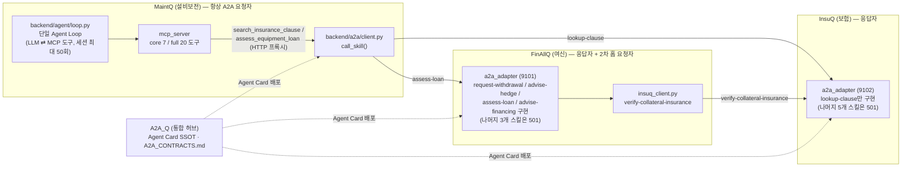
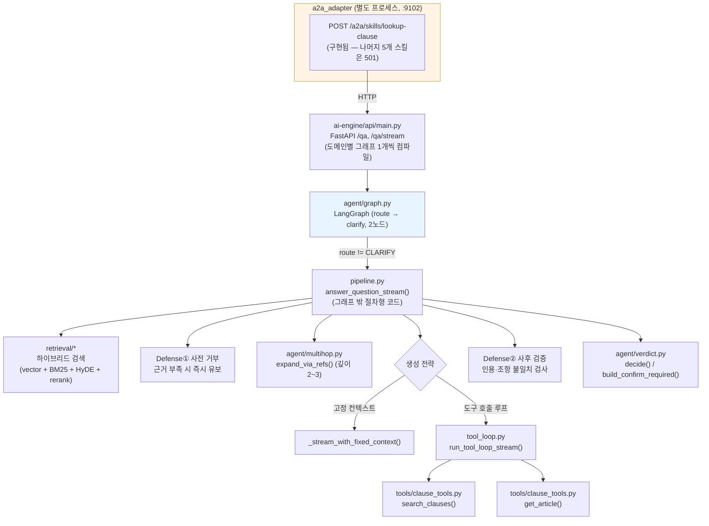
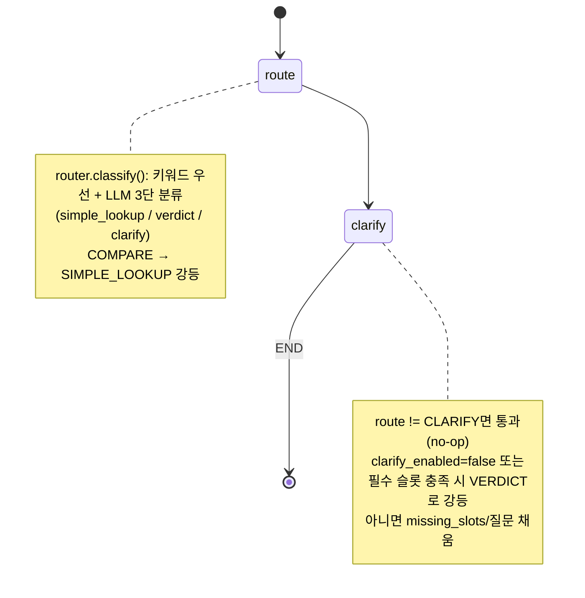
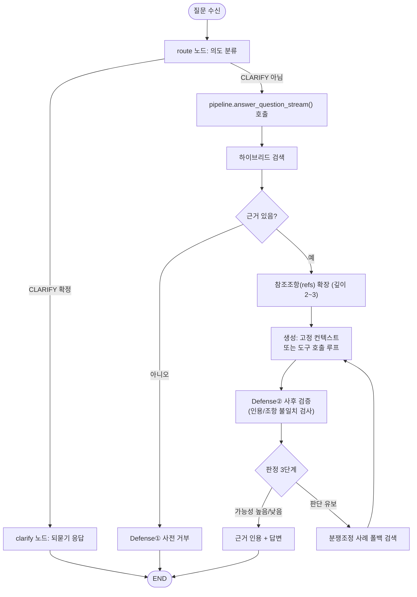
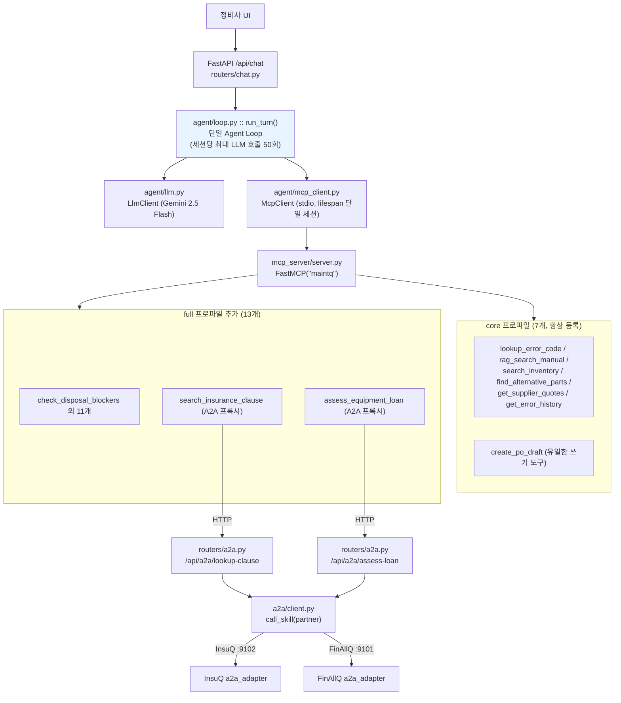
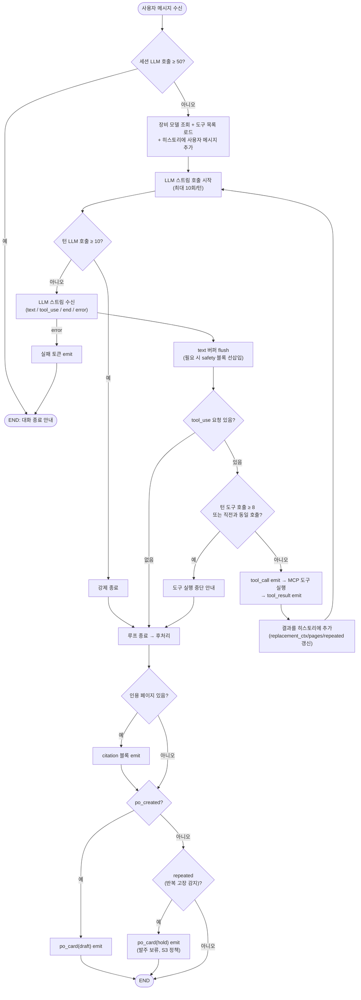
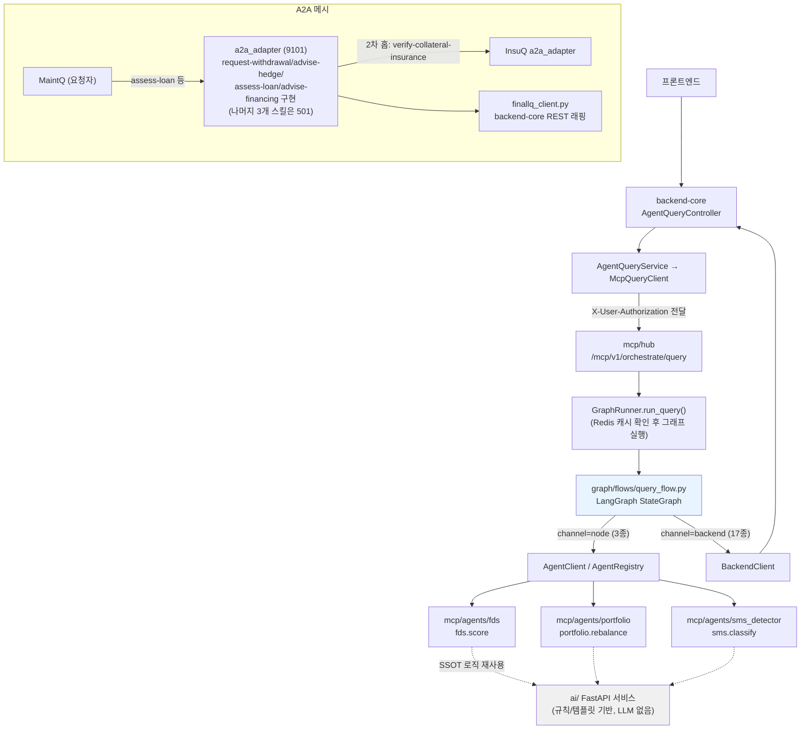
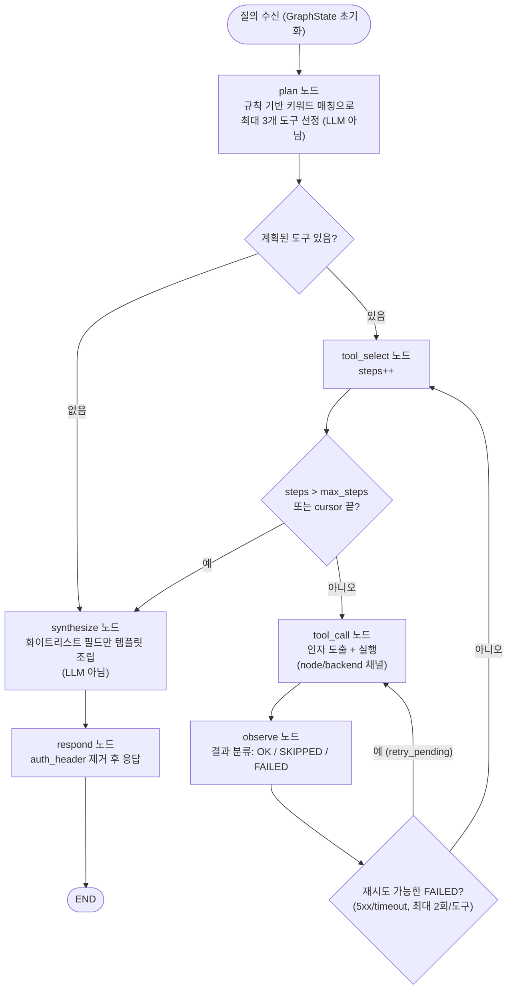

# Agent 계층도 & AI 노드 흐름도 (InsuQ · MaintQ · FinAllQ)

**작성 기준:** 2026-08-24, 세 레포지토리(`../InsuQ`, `../MaintQ`, `../FinAllQ`)의 실제 코드를 직접 읽어 작성.
**주의:** 각 레포의 기존 문서(`InsuQ/docs/05_ARCHITECTURE.md`, `FinAllQ/docs/architecture.md`)에는 아직 구현되지 않은 구상 단계(aspirational) 다이어그램이 섞여 있습니다. 아래 다이어그램은 **실제 구현된 흐름**을 우선하고, 구상 단계와 다른 부분은 각주로 표시했습니다.

---

## 0. 전체 개요 — Cross-repo A2A 메시

세 시스템 모두 A2A(Agent-to-Agent) 프로토콜로 연결되지만 역할이 다릅니다. **MaintQ는 항상 요청자(client)**이고, FinAllQ와 InsuQ는 응답자(responder)입니다. FinAllQ는 일부 시나리오에서 InsuQ에 대해 2차 홉 요청자 역할도 겸합니다.

> `docs/A2A_CONTRACTS.md`(MaintQ)에는 트리거→스킬 매핑이 10건 정의되어 있지만, 실제로 코드로 연결된 것은 `lookup-clause`·`assess-loan` 2건뿐입니다. 나머지는 계약 문서상으로만 존재합니다.

> **2026-08-24 갱신 — 위 다이어그램의 `InsuQ` 서브그래프는 ai-engine의 `a2a_adapter`(:9102, FastAPI)만
> 그린 것입니다.** 이 어댑터 자체는 지금도 `lookup-clause`만 구현하고 나머지가 501인 것이 맞지만,
> InsuQ에는 이 다이어그램에 없는 **두 번째 A2A 창구**가 있습니다 — `backend`(Spring, :8081)의
> `A2aController`입니다. Sprint 13(A2A 트랙7)이 main에 병합되면서 이 backend 창구가
> `verify-collateral-insurance`·`advise-policy-renewal`·`notify-asset-change`·`claim-insurance`
> 4개 스킬을 실제로 서빙합니다(서비스 간 인증·request_chain_id 감사로그·Idempotency-Key·A2A Task
> 상태머신 포함). **2026-08-24 갱신 — `notify-risk-change`(S14)도 Sprint 14로 구현 완료**
> (Dev→Tester→Reviewer 게이트 통과, `feat/notify-risk-change` → main 머지, 실 컨테이너 재빌드 후
> curl로 정상 판정·대역 경계·Idempotency 재생/충돌·거부 경로 6종 직접 검증).
> 즉 InsuQ의 "구현된 스킬"은 위 다이어그램의 1개(`lookup-clause`)가 아니라 **두 창구를 합쳐 5개 중
> 5개 전부**입니다. 501로 남은 것은 이 다이어그램이 그린 `lookup-clause` 하나뿐입니다. 최신
> 상태는 InsuQ 레포의 `docs/status_audit.html`을 참고하세요(main 커밋 `687d616`).

---

## 1. InsuQ — 보험 약관 Q&A

### 1.1 Agent 계층도

InsuQ는 "멀티 에이전트"가 아니라 **얇은 LangGraph 라우터 + 절차형 파이프라인** 구조입니다. `docs/05_ARCHITECTURE.md`가 언급하는 "Supervisor-Worker 멀티 에이전트"는 향후 계획(Track 2)이며 현재 코드에는 없습니다.

> `ai-engine/insuq_ai/mcp_server/__init__.py`는 빈 스텁입니다. `05_ARCHITECTURE.md`가 그리는 "MCP 서버 노출" 화살표는 아직 구현되지 않았습니다.

### 1.2 AI 노드 흐름도

**(a) 실제 LangGraph — 노드가 2개뿐입니다.** `05_ARCHITECTURE.md`의 `stateDiagram-v2`(Routing→Retrieve→Rerank→HopCheck→Generate→Verdict→...)는 구상 단계이며, 실제 컴파일된 그래프는 아래가 전부입니다.

**(b) 실제 답변 생성 실행 흐름 (그래프 노드가 아닌 절차형 코드)** — `route_and_answer_stream()`이 그래프 밖에서 `pipeline.py`를 호출하는 파이썬 분기입니다.

---

## 2. MaintQ — 설비 보전 에이전트

### 2.1 Agent 계층도

LangGraph를 쓰지 않는 **단일 에이전트 루프**(`backend/agent/loop.py`) 구조입니다. 라우터/서브에이전트 분기가 없고, 도구 실행만 MCP 서버로 위임합니다.

> `mcp_server` 프로세스는 파트너 자격증명을 직접 들고 있지 않고, 인증은 `backend/a2a/auth_header.py::build_auth_header()`가 담당합니다(D15/D93 설계 원칙 — 단 **스킴 자체는 2026-08-24에 D120으로 Basic에서 Bearer+`X-A2A-Partner-Id`로 교체**됐습니다. InsuQ·FinAllQ 실 인증 필터와 대조한 결과였습니다).

### 2.2 AI 노드 흐름도 — Agent Loop 제어 흐름

LangGraph가 없으므로 "노드 그래프"보다 **루프백 엣지가 있는 플로우차트**가 실제 구조에 더 가깝습니다 (`run_turn()`, `backend/agent/loop.py:316-656`).

---

## 3. FinAllQ — 여신 심사 / 금융

### 3.1 Agent 계층도

FinAllQ는 세 시스템 중 유일하게 **실제 LangGraph 오케스트레이터**(`mcp/hub`)를 갖고 있지만, `docs/architecture.md:28`이 명시하듯 **이 그래프 안에 LLM은 없습니다** — 계획(plan)과 합성(synthesize) 모두 규칙/템플릿 기반입니다.

> `docs/architecture.md`의 기존 mermaid 다이어그램에는 `G[LLM / LangGraph - 설명용]` 노드가 있지만, 이는 이 그래프보다 먼저 작성된 오래된/구상 단계 다이어그램이며 실제 구현(LLM 없음)과 다릅니다.

### 3.2 AI 노드 흐름도 — 실제 LangGraph (`mcp/hub/app/graph/flows/query_flow.py`)

---

## 4. 세 시스템 비교 요약

| 항목 | InsuQ | MaintQ | FinAllQ |
|---|---|---|---|
| **그래프 프레임워크** | LangGraph (2노드만) | 없음 (직접 구현 루프) | LangGraph (6노드) |
| **그래프 안 LLM 존재?** | 예 (생성은 그래프 밖 파이프라인) | 예 (루프 안에서 매 턴 호출) | **아니오** (plan/synthesize 모두 규칙 기반) |
| **실제 "멀티 에이전트"?** | 아니오 (단일 라우터 + 절차형 파이프라인) | 아니오 (단일 에이전트 루프) | 부분적 (하위 MCP 에이전트 노드 3종: fds/portfolio/sms, LLM 없는 결정론적 서비스) |
| **A2A 역할** | 응답자 (스킬 1/6 구현) | 항상 요청자 | 응답자 + 2차 홉 요청자 (스킬 4/7 구현) |
| **도구 호출 방식** | LLM 도구 호출 루프 (선택적) | LLM 도구 호출 루프 (매 턴 필수 아님) | 그래프 노드가 도구 채널(node/backend) 직접 호출 |
| **루프/재시도 상한** | 없음 (그래프 자체가 짧음) | 세션 50회 / 턴 10회 / 도구 8회 | 도구별 재시도 최대 2회 |
| **기존 문서와의 차이** | `05_ARCHITECTURE.md`의 6노드 상태도는 구상 단계, 실제는 2노드 | `09_RUNTIME.md`는 시퀀스 다이어그램만 보유 (정확) | `architecture.md`의 LLM 노드는 구상 단계, 실제는 LLM 없음 |

---

**관련 문서:**
- `InsuQ/docs/05_ARCHITECTURE.md` — 기존 mermaid (일부 구상 단계)
- `MaintQ/docs/09_RUNTIME.md` — 기존 시퀀스 다이어그램 (실제 흐름과 일치)
- `FinAllQ/docs/architecture.md` — 기존 mermaid (FDS 흐름, 일부 구상 단계)
- `docs/A2A_CONTRACTS.md` (MaintQ) — 나가는 요청 트리거→스킬 매핑 (10건 정의, 2건 구현)
- `docs/presentation/README.md` (본 레포) — 세 프로젝트 성능/기술 비교 요약
