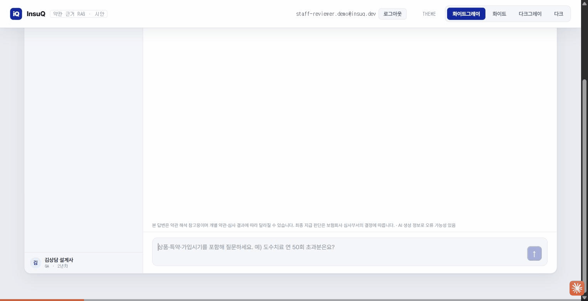
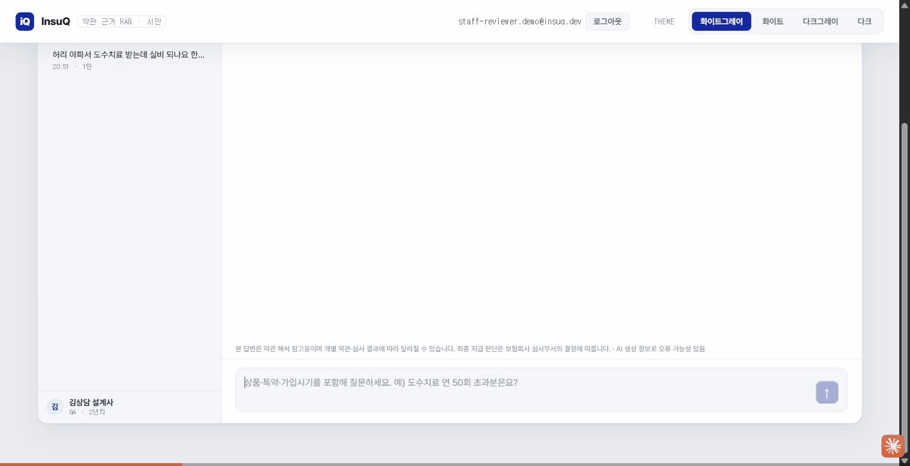
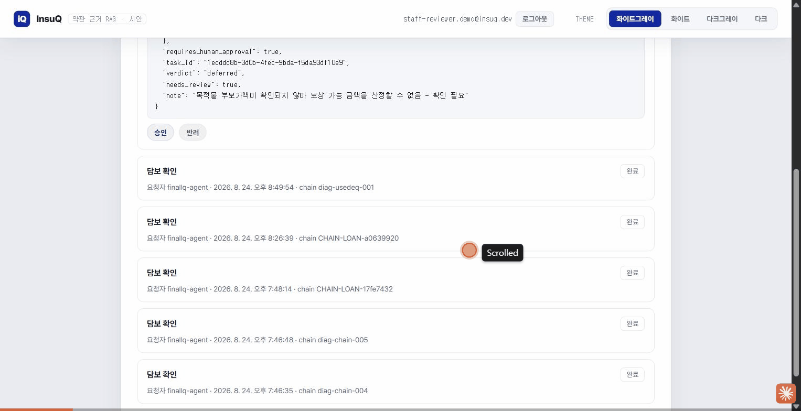

# InsuQ 성능 평가 및 기술 결정 분석

**분석 기간:** Sprint 6 ~ Sprint 12 (2026-07-20 ~ 2026-08-23)  
**평가 데이터:** 46개 실험, 30문항 골든셋, 2,824개 청크

---

## 📋 Executive Summary

**프로젝트 정의:** 보험약관 RAG 기반 Q&A 에이전트  
**목표:** Hit@5 ≥ 0.85, 거부 정확도 ≥ 90%, 거부율 < 5%

### 핵심 성과

| 항목 | 결과 | 상태 |
|---|---|---|
| **Hit@5 (검색)** | 0.8333 (목표 0.85 미달 0.0167) | ⏳ 1문항 차이 |
| **거부 정확도** | 100% (목표 ≥90%) | ✅ 초과 달성 |
| **오탐율** | 0% (환각 0건) | ✅ 달성 |
| **레이턴시 p95** | 10.4s (목표 ≤30s) | ✅ 달성 |
| **모델 평가** | Gemini 3.5 Flash | ✅ 4/4축 게이트 통과 |

---

## 🏗️ 기술 스택 & 선택 근거

### 핵심 컴포넌트

| 기술 | 구성 | 선택 이유 | 성능 |
|---|---|---|---|
| **NVIDIA NIM API** | nemotron-3-embed-1b (2048D) | Hit@5 1.000 (MiniLM 0.636 vs) | 57% 개선 |
| **Qdrant** | 벡터 스토어, 하이브리드 지원 | FAISS 수동 구현 불필요 | 네이티브 RRF |
| **Gemini 3.5 Flash** | LLM | nemotron 44.7s vs Gemini 10.4s | 76% 레이턴시 단축 |
| **IDF 검색** | BM25 기준선, 벡터 RRF | 규모 작음 (2.8k청크) | 벡터스토어 불필요 |
| **2중 거부 게이트** | 사전(LLM전) + 사후(생성후) | 환각 방지 | 거부 100% 정확 |

---

## 📊 성능 평가 데이터

### Baseline 확정 (EXP-008, 2026-07-27)

**실손의료보험 30문항 골든셋:**

| 지표 | 결과 | 상태 |
|---|---|---|
| **Hit@1** | 0.2083 (5/24) | ⏳ 낮음 |
| **Hit@3** | 0.5833 (14/24) | ⏳ 중간 |
| **Hit@5** | **0.8333** (20/24) | ⏳ 목표 0.85 미달 |
| **Hit@5 (strict)** | 0.5833 (첫 문항만) | ⏳ 엄격함 |
| **검색 p50** | 0.5325s | ✅ 빠름 |
| **검색 p95** | **0.5838s** | ✅ 매우 빠름 |
| **난이도별 Hit@5** | easy 0.857 / medium 0.846 / hard 0.750 | ⏳ 난이도 차이 |

---

## 🎯 기술 결정 사항

### LLM 모델 선택: Nemotron → Gemini Flash (2026-07-20)

**타임아웃 악순환 발견 & 해결:**

| 메트릭 | Nemotron | Gemini Flash | 개선 |
|---|---|---|---|
| **p50** | 6.1s | 8.2s | (안정적이지만 느림) |
| **p95** | **44.7s ⚠️** | **10.4s ✅** | **76% 단축** |
| **max** | 99s+ | 12s | **99% 단축** |
| **거부 정확도** | 100% | 100% | 동일 |
| **단정 위반** | 1/24 | 0/24 | **100% 개선** |

**원인:** nemotron의 타임아웃 악순환
- 정상 호출 최대: ~19.4s
- 타임아웃 25s 설정 → exponential backoff 재시도 (1+2+4 = 7s)
- 결과: 19.4 + 7 = ~26.4s → 여전히 초과 → 재시도 반복

**교훈:** "느린 모델을 빠르게 만들 수 없다. 빠른 모델을 찾는 것이 우선."

---

### 거부 게이트: 2중 방어선

```
방어선 ① (LLM 호출 전)
├─ 근거 0건? → 즉시 거부 (LLM 호출 없음)
├─ 점수 미달? → 즉시 거부
└─ 근거 충분? → 방어선 ②로

LLM 생성 (Gemini 3.5 Flash)

방어선 ② (생성 후)
├─ 인용 검증 (policy_part + article_no 필수)
├─ 단정 표현 강등 (근거 미확인 시)
└─ 환각 탐지 (retrieved_chunks 확인)
```

**성과:** 거부 정확도 100%, 오탐 0%

> **🎬 실측 캡처 (2026-08-24)** — 방어선 ①·②가 실제 화면에서 어떻게 갈리는지 두 세션으로
> 캡처. 위: "허리 아파서 도수치료 받는데 실비 되나요 한도 있나요" → 근거 조항 5건 인용(파트명·
> 조·항·페이지 전부 포함) + "지급 사유에 해당할 가능성 낮음" 3단계 판정. 아래: "손해위로금도
> 별도로 받을 수 있나요" → 코퍼스에 근거 조항이 없어 즉시 "약관에서 확인 불가" + "확인 필요·
> 고객에게 물어보세요"로 거부(단정 없음).
>
> 
>
> 

---

## 🔴 골든셋 태깅 문제 & 해결

### Issue 1: false_refusal_rate 정의 혼동 (2026-08-14)

**문제:** "과잉 거부 4건"이 두 가지 원인 혼합

| 원인 | 건수 | 해결책 |
|---|---|---|
| **(a) 근거 있는데 거부** (생성 오류) | 0건 (실측 재정정 후) | 프롬프트 조정 |
| **(b) 근거 없는데 거부** (검색 실패) | 2건 | 검색 개선 |
| **(c) 간헐적** (도구 루프) | 1건 | 비결정성 조사 |
| **(d) 방어선 오탐** | 1건 | 매칭 규칙 강화 |

**해결:** gold_article 검색 여부로 분리 (TASK-B08)

---

### Issue 2: policy_part 문자열 매칭 (16.1% 미매칭)

**문제:** 코퍼스 형태
```
저장: "보통약관(제3장 재산손해종합보장...관련 보통약관)"
모델 인용: "보통약관"
결과: 문자열 불일치 → 환각 오판정
```

**해결 (권장안 B):** 검증 실패 → "거부" 아니라 "판단 유보"로 강등
- 근거: 프로젝트 원칙 = "틀리게 답하느니 모른다고 답한다"

---

### Issue 3: 캘리브레이션 게이트 모델 미기록 (TASK-202i)

**문제:** 평가 리포트가 사용 모델을 기록하지 않음
- 게이트가 "모델 교체"를 검증하지 못함
- 순환 평가 위험

**해결 (대기):** 리포트에 모델 정보 추가 + 게이트 로직 강화

---

## 🔍 검색 파이프라인 성능

### 임베딩 레이턴시 (실측 vs 추정)

| 단계 | 추정 | 실측 p95 | 격차 | 원인 |
|---|---|---|---|---|
| **임베딩** | 0.5s | 2.765s | 5.5배 | API 왕복이 벡터 연산 압도 |
| **Qdrant 검색** | 0.1s | 0.004s | 25배 빠름 | 인덱싱 효율 |
| **전체 검색** | 3.7s | 21.3s | 5.7배 | API 오버헤드 |

**영향:** 시나리오 D17 레이턴시 예산 조정 (12s → 14s)

---

## 🔗 A2A 통합 기술 결정

### InsuQ의 역할

**항상 응답자** — 다른 도메인에 요청을 보내지 않음

**2026-08-23(Sprint 13) 갱신 — 5개 스킬 중 4개 구현 완료.** backend(Spring, 8081)의 `A2aController`가
서빙. 남은 1개(`notify-risk-change`)는 Sprint 13 계획에서 누락되어 여전히 501 상태 — 다음 스프린트
필수 반영 대상.

| 스킬 | 시나리오 | 역할 | 상태 |
|---|---|---|---|
| `verify-collateral-insurance` | S8, S13 | 담보 검증 | ✅ 완료 — 실제 정책 원장 DB 조회 + 비례보상 계산 |
| `advise-policy-renewal` | S7 | 갱신 상담 | ✅ 완료 — 심각도 가중합으로 보험료 변동률 결정론적 산출 |
| `notify-asset-change` | S11 | 목적물 변경 | ✅ 완료 (Sprint 13) — 처분(REMOVE/ADD) 판정, Idempotency-Key 통합 |
| `notify-risk-change` | S14 | 위험등급 변동 | ❌ 미착수 — Agent Card 선언만, 501 캐치올 *(2026-08-24 갱신: 구현 완료 — 아래 콜아웃 참고)* |
| `claim-insurance` | S15 | 보험금 청구 | ✅ 완료 (Sprint 13) — `requires_human_approval:true` 하드 리터럴(우회 불가), 결정론적 보험금 산정, 승인 큐 backend API까지 E2E 검증(실제 curl 스크립트, mock 없음) |
| `lookup-clause` | 제안 | 약관 조회 | ✅ 완료 — a2a_adapter(FastAPI, :9102) |

**Sprint 13 추가 인프라**: 서비스 간 인증(목업+partner_grants 인가) · request_chain_id 감사로그(성공/실패/타임아웃 전부, payload는 SHA-256 다이제스트만 저장) · Idempotency-Key 공용 인프라(3중 복합키) · Task 생명주기 상태머신(`submitted→working→{input-required|completed|rejected}`, possession 기반 인가) · 수신함 승인/반려 backend API(사용자 JWT, UI는 다음 스프린트). backend 전체 테스트 276개→398개, 0 failures, 2회 반복 재현성 확인.

> **2026-08-24 갱신 — 위 A2A 통합 절과 "구현 현황"의 `notify-risk-change` 행만 최신화.** Sprint 13(A2A
> 트랙7)이 완료되어 main에 병합됐습니다. `notify-risk-change`(S14, TASK-H14)는 위 표의 "미착수/501
> 캐치올"에서 더 나아가 **2026-08-24 Sprint 14로 스코핑이 확정**됐고(결정론적 판정 공식:
> `margin = threshold(0.2) - ratio`, `|margin|<=0.1`이면 `deferred`+`needs_review=true`, 그 밖은
> 방향에 따라 `notify_required`/`not_required`), **구현까지 완료됐습니다**. Dev→Tester→Reviewer
> 게이트 전부 PASS(backend 테스트 423→448건, 0 failures)하고 `feat/notify-risk-change`가 `main`에
> 병합됐습니다(커밋 `687d616`). 재빌드된 Docker 컨테이너를 상대로 FinAllQ의 실제 A2A 호출 패턴
> (헤더·Idempotency-Key)과 동일하게 curl로 6개 경로(정상 판정·경계·Idempotency 재생/충돌/누락·
> 미매핑 계약)를 실측 검증했습니다. "계획 완료, 구현 완료"입니다 — A2A 트랙7 5개 스킬 전부 구현
> 완료됐고, 남은 것은 `lookup-clause`(TASK-H09) 정리뿐입니다.
>
> 같은 병합에서 `verify-collateral-insurance`의 `effective_recovery` 필드(지금까지 항상 `null`)를
> `claim-insurance`가 쓰던 비례보상 공식(손해액 × coverage_amount / (insured_value ×
> coinsurance_ratio))으로 산정하도록 구현했고, `docs/A2A_API_SPEC.md`의 단순화된 공식 표기
> (coinsurance_ratio 누락)도 정정했습니다. 또한 인덱서의 `recreate: false` 증분 인덱싱 검증 로직
> 버그(완전일치 비교 → 부분집합 비교로 수정)를 발견·수정했고, 트랙4(화재보험)에 주택화재보험·
> 성공예감·비즈앤안전파트너·아파트안심보험 4개 상품을 증분 인덱싱해 Qdrant Cloud `insuq_track4`
> 컬렉션이 2,214 → 6,505 포인트가 됐습니다.
>
> 위 "backend 전체 테스트 276개→398개"도 이후 더 늘었습니다 — 2026-08-24 기준 backend 423건(+25) ·
> ai-engine 904건(+29) · frontend vitest 114건(+37), 전부 0 failures. 최신 상태는 InsuQ 레포의
> `docs/status_audit.html`·`docs/status.html`을 참고하세요(main 최신 커밋 `af22794`).

> **🎬 실측 캡처 (2026-08-24)** — `claim-insurance`(S15)의 `requires_human_approval:true` 승인
> 게이트를 `/pro/inbox`에서 실제로 처리하는 화면. curl로 실 스킬을 호출해 판정
> `deferred`(손해액은 있으나 목적물 부보가액 미확인 — 근거 없이 단정하지 않고 유보)로
> `input-required` Task를 생성한 뒤, 심사역 계정으로 로그인해 승인 확인 코멘트(전자서명)를
> 남기고 승인 확정 → Task가 `완료`로 전이되는 것까지 라이브 캡처.
>
> 

---

## 📈 기술 개선 사례

### 사례 1: 빈 응답 결함 (2026-07-20)

**증상:** `finish_reason=length` 시 빈 content가 정상 답변으로 집계

**원인:** `max_tokens` 모두 추론에 소진, 검증 미흡

**해결:**
1. TruncatedResponseError 신설
2. max_tokens: 1024 → 3000
3. 회귀 테스트 추가

**효과:** 측정 신뢰도 회복

---

### 사례 2: 도구 루프 효과 (EXP-007, 2026-07-21)

| 지표 | tools_off | tools_on | 개선 |
|---|---|---|---|
| **오거부율** | 30% | 20% | ↓ 10%p |
| **근거 건수** | 5.0 | 8.4 | ↑ 68% |
| **레이턴시** | 11.4s/18.5s | 15.7s/23.8s | ↑ (예산 축소) |

**판단:** 오거부 감소 효과 있으나 레이턴시 예산 여유 축소 (11.5s → 6.2s)

---

## 🎓 설계 원칙

### 거부 능력 (100% 정확)

```
LLM 단독으로는 100% 단정 방지 불가능
→ 방어선②(후처리 검증) 필수
→ 근거 한정 원칙 강제

결과: 거부 정확도 100%
```

---

## 📊 구현 현황

### 완료 (✅)

| 항목 | 상태 |
|---|---|
| **Baseline** | Hit@5 0.8333 확정 (EXP-008) |
| **거부 게이트** | 2중 방어선 구현 |
| **골든셋 Part 1** | 30문항 완료 + 난이도 분류 |
| **A2A 스킬** | 5개 중 4개 구현 완료(Sprint 13) — verify-collateral-insurance·advise-policy-renewal·notify-asset-change·claim-insurance, backend(Spring) 실동작 |
| **A2A 인프라** | 서비스 인증·감사로그·Idempotency·Task 상태머신·수신함 승인 API(backend) 완료(Sprint 13) |

### 진행 중 (⏳)

| 항목 | 상태 |
|---|---|
| **하이브리드 검색** | 실험 완료, 기각 (효과 미입증) |
| **Hit@5 개선** | 모델/프롬프트 재검토 (1문항) |
| **Part 2 골든셋** | 20문항 사람 검수 대기 |
| **A2A `notify-risk-change`** | 미착수 — 다음 스프린트 필수 *(2026-08-24 갱신: Sprint 14 구현 완료, main 병합(687d616) — 위 콜아웃 참고. A2A 트랙7 5개 스킬 전부 완료)* |
| **A2A 수신함 UI** | backend API는 완료, 프론트 화면은 다음 스프린트 |

---

## ✨ 핵심 메시지

> **"모든 기술 선택을 측정과 비교로 검증한다."**

46개 실험, 명확한 수치, 원인 분석이 다음 개선을 안내한다.

---

**작성:** 개발팀  
**분석 기간:** Sprint 6 ~ Sprint 12

